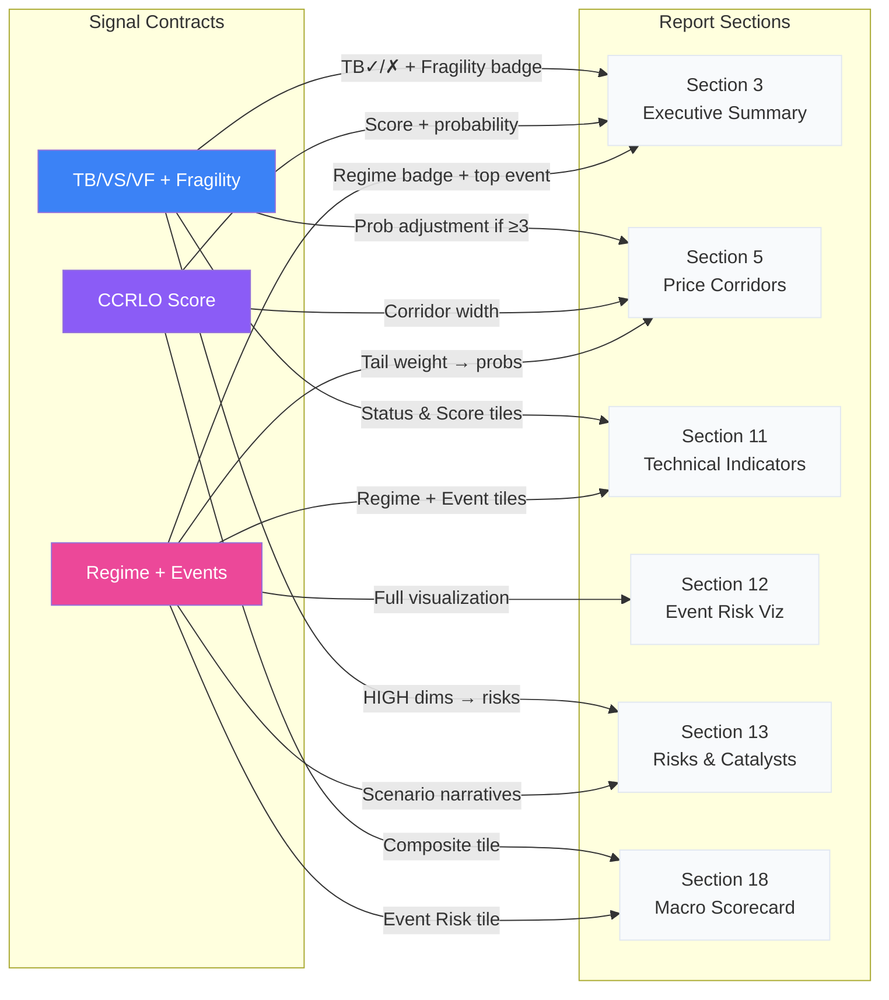
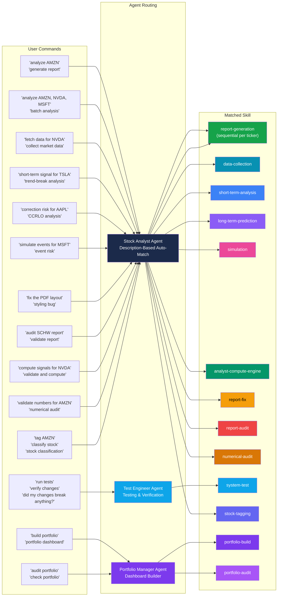
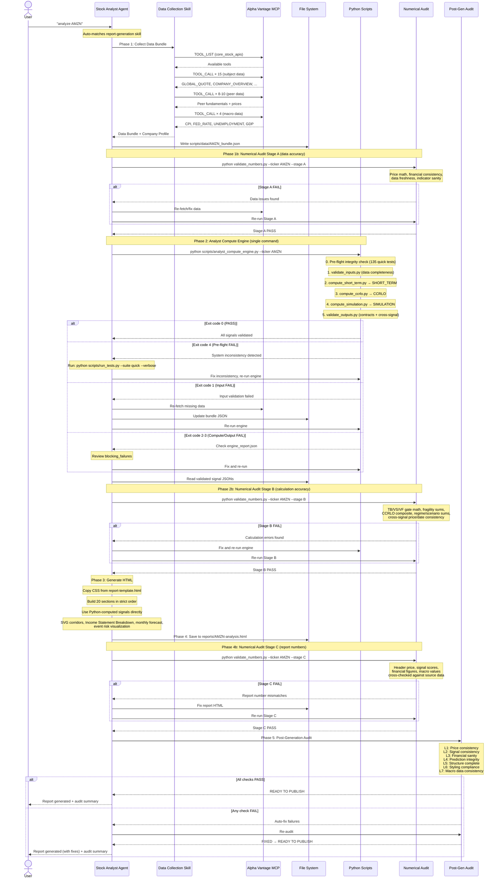
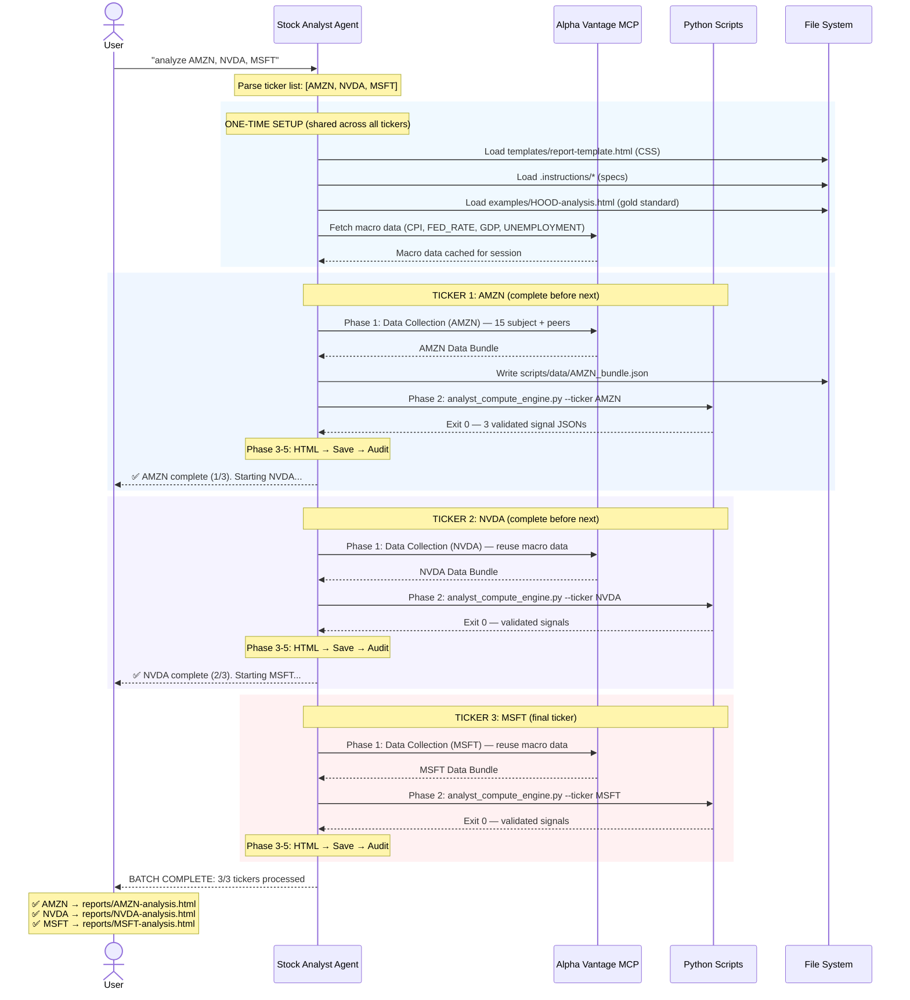
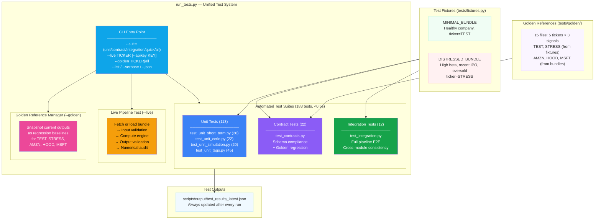
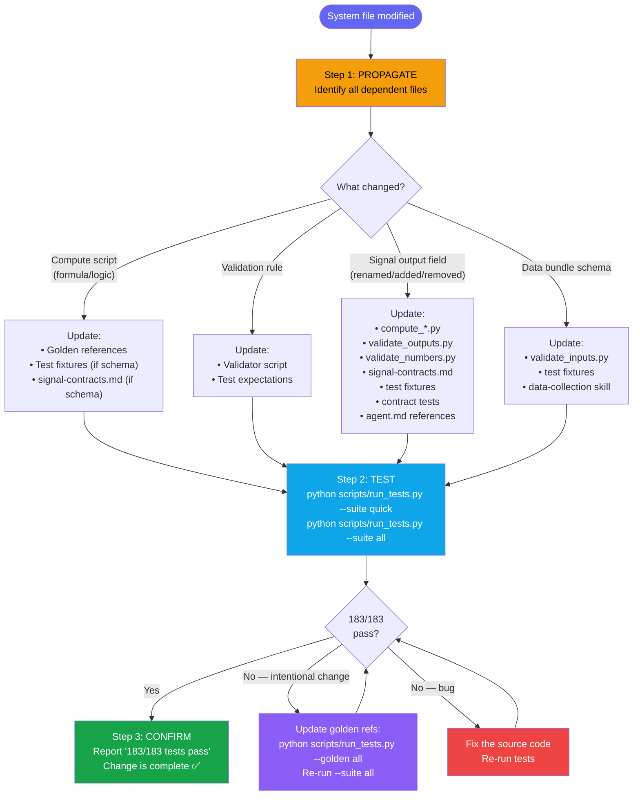
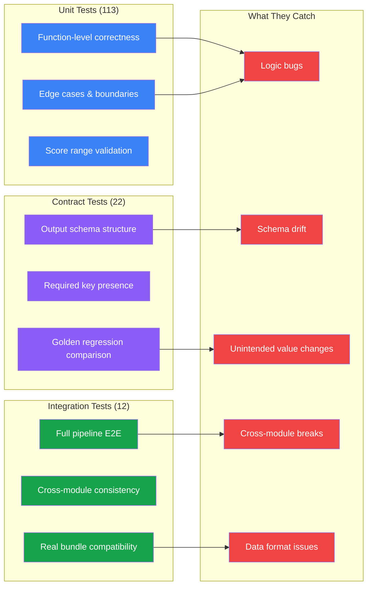

# Market Analysis — System Architecture

## System Overview Diagram

```mermaid
graph TB
    %% ========================================
    %% USER INTERACTION LAYER
    %% ========================================
    User([fa:fa-user User])

    subgraph Triggers["User Triggers"]
        T1["analyze TICKER"]
        T2["short-term signal for TICKER"]
        T3["correction risk for TICKER"]
        T4["simulate events for TICKER"]
        T5["fix the layout"]
        T6["audit report"]
        T7["fetch data for TICKER"]
        T8["analyze TICKER1, TICKER2, TICKER3<br/>(sequential multi-ticker)"]
        T9["validate numbers for TICKER"]
        T10["run tests / verify changes"]
    end

    User --> Triggers

    %% ========================================
    %% AGENT LAYER (two specialized agents)
    %% ========================================
    subgraph Agents["Agent Layer"]
        direction LR
        SA["stock-analyst.agent.md<br/>───────────────────<br/>Orchestrates analysis skills<br/>70+ tools available<br/>Auto-matches skills by description"]
        TE["test-engineer.agent.md<br/>───────────────────<br/>System testing & verification<br/>Runs test suites, diagnoses failures<br/>Manages golden references<br/>Enforces Change Verification Protocol"]
        PM["portfolio-manager.agent.md<br/>───────────────────<br/>Portfolio dashboard builder<br/>Aggregates all analyzed tickers<br/>build_portfolio.py + audit_portfolio.py"]
    end

    Triggers --> Agents

    %% ========================================
    %% SKILL LAYER (13 skills, auto-matched)
    %% ========================================
    subgraph Skills["Skills Layer — Auto-Matched by Description"]
        direction TB

        subgraph DataSkill["Data Collection"]
            DC["data-collection/SKILL.md<br/>──────────────────<br/>MCP API calls<br/>15 subject + peers + macro<br/>Company profile classification<br/>Outputs: Data Bundle"]
        end

        subgraph ComputeSkills["Analyst Compute Engine"]
            direction LR
            ACE["analyst-compute-engine<br/>──────────────────<br/>Unified Python pipeline<br/>analyst_compute_engine.py<br/>Phase 0: pre-flight (135 tests)<br/>validate → compute → validate<br/>Single command, exit codes 0-4<br/>Outputs: Signal JSONs + report"]
        end

        subgraph AnalysisSkills["Standalone Analysis Skills"]
            direction LR
            ST["short-term-analysis<br/>──────────────────<br/>TB/VS/VF gates<br/>Fragility Score 0-5<br/>Outputs: SHORT_TERM_SIGNAL"]
            LT["long-term-prediction<br/>──────────────────<br/>CCRLO scoring 0-21<br/>7 macro-financial features<br/>Outputs: CCRLO_SIGNAL"]
            SIM["simulation<br/>──────────────────<br/>Regime detection<br/>6 events × 3 horizons<br/>4 scenario weights<br/>Outputs: SIMULATION_SIGNAL"]
            TAG["stock-tagging<br/>──────────────────<br/>5-dimension classification<br/>Profile/Sector/Risk/Momentum/Val<br/>Outputs: TAG_SIGNAL"]
        end

        subgraph OutputSkills["Output Skills"]
            direction LR
            RG["report-generation<br/>──────────────────<br/>20-section HTML report<br/>Uses Python-computed signals<br/>Phase 5: post-gen audit (7 layers)<br/>Outputs: HTML file"]
            RF["report-fix<br/>──────────────────<br/>Diagnose & repair<br/>PDF layout, CSS, SVG<br/>Outputs: Fixed HTML"]
            RA["report-audit<br/>──────────────────<br/>7-layer QA check<br/>Standalone deep audit<br/>Outputs: Audit report"]
        end

        subgraph ValidationSkills["Numerical Validation"]
            NA["numerical-audit<br/>──────────────────<br/>3-stage accuracy pipeline<br/>A=data B=signals C=report<br/>validate_numbers.py<br/>Outputs: Numerical audit JSON"]
        end

        subgraph TestSkills["System Testing"]
            SYS["system-test<br/>──────────────────<br/>183 automated tests (6 suites)<br/>Golden reference regression<br/>Docs consistency verification<br/>Live AV pipeline test<br/>Change verification protocol"]
        end
    end

    SA --> DC
    SA --> ACE
    SA --> ST
    SA --> LT
    SA --> SIM
    SA --> RG
    SA --> RF
    SA --> RA
    SA --> NA
    TE --> SYS
    TE --> NA

    %% ========================================
    %% DATA FLOW
    %% ========================================
    subgraph ExternalData["Alpha Vantage MCP Server"]
        AV["TOOL_LIST / TOOL_GET / TOOL_CALL<br/>──────────────────<br/>Stock APIs: GLOBAL_QUOTE, COMPANY_OVERVIEW, etc.<br/>Technical: RSI, MACD, BBANDS, SMA, EMA, ADX, ATR<br/>Macro: CPI, FED_FUNDS, UNEMPLOYMENT, GDP<br/>Sentiment: NEWS_SENTIMENT, INSTITUTIONAL_HOLDINGS"]
    end

    DC -->|"MCP calls"| AV
    AV -->|"Raw data"| DC

    %% ========================================
    %% SIGNAL PIPELINE (data dependencies)
    %% ========================================
    DC -->|"Data Bundle JSON"| ACE
    ACE -->|"Validated Signals"| RG

    DC -->|"Data Bundle"| ST
    DC -->|"Data Bundle"| LT
    DC -->|"Data Bundle"| SIM

    ST -->|"SHORT_TERM_SIGNAL<br/>(fragility feeds SIM)"| SIM
    LT -->|"CCRLO_SIGNAL<br/>(score feeds SIM)"| SIM

    ACE -->|"SHORT_TERM_SIGNAL"| RG
    ACE -->|"CCRLO_SIGNAL"| RG
    ACE -->|"SIMULATION_SIGNAL"| RG

    %% ========================================
    %% LOCAL COMPUTE LAYER
    %% ========================================
    subgraph LocalCompute["Python Scripts (Local Compute)"]
        ENGINE["analyst_compute_engine.py<br/>Unified orchestrator"]
        PY1["compute_short_term.py<br/>TB/VS/VF + Fragility"]
        PY2["compute_ccrlo.py<br/>7 features → Score 0-21"]
        PY3["compute_simulation.py<br/>Regime + Events + Scenarios"]
        VI["validate_inputs.py<br/>Data bundle validation"]
        VO["validate_outputs.py<br/>Signal contract validation"]
        VN["validate_numbers.py<br/>Numerical accuracy audit"]
        PY4["compute_tags.py<br/>5-dimension stock classification"]
        RT["run_tests.py<br/>Unified test runner<br/>183 tests · 6 suites · live AV"]
        BP["build_portfolio.py<br/>Portfolio aggregation + HTML gen"]
        AP["audit_portfolio.py<br/>Portfolio 8-layer audit"]
        PO["portfolio_optimizer.py<br/>Evidence-based construction engine"]
    end

    ACE --> ENGINE
    ENGINE --> VI
    ENGINE --> PY1
    ENGINE --> PY2
    ENGINE --> PY3
    ENGINE --> VO
    NA --> VN
    SYS --> RT
    PM --> BP
    BP --> PO
    BP --> AP

    %% ========================================
    %% REFERENCE LAYER
    %% ========================================
    subgraph References["Reference Documents"]
        direction LR

        subgraph Contracts["Signal Contracts"]
            SC["signal-contracts.md<br/>──────────────────<br/>SHORT_TERM_SIGNAL schema<br/>CCRLO_SIGNAL schema<br/>SIMULATION_SIGNAL schema<br/>Validation rules"]
        end

        subgraph Specs[".instructions/"]
            direction TB
            I1["data-collection.md"]
            I2["report-layout.md"]
            I3["styling.md"]
            I4["analysis-methodology.md"]
            I5["analysis-reference.md"]
            I6["short-term-strategy.md"]
            I7["long-term-strategy.md"]
            I8["simulation-strategy.md"]
        end

        subgraph Templates["Templates & Examples"]
            TP["templates/report-template.html<br/>(CSS source of truth)"]
            EX["examples/HOOD-analysis.html<br/>(Gold standard report)"]
        end
    end

    SC -.->|"defines output schema"| ST
    SC -.->|"defines output schema"| LT
    SC -.->|"defines output schema"| SIM
    SC -.->|"validates signals"| RG

    %% ========================================
    %% OUTPUT LAYER
    %% ========================================
    subgraph Output["Generated Reports"]
        RPT["reports/TICKER-analysis.html<br/>──────────────────<br/>20-section standalone HTML<br/>PDF-exportable (A4 landscape)<br/>All signals integrated"]
    end

    RG -->|"Phase 4: Save"| RPT
    RG -->|"Phase 5: Post-Gen Audit"| RPT
    RF -->|"Fixed report"| RPT
    RA -->|"Audit findings"| RPT

    %% ========================================
    %% STYLING
    %% ========================================
    classDef agent fill:#1b2a4a,stroke:#1b2a4a,color:#fff
    classDef skill fill:#2563eb,stroke:#1e40af,color:#fff
    classDef data fill:#0891b2,stroke:#0e7490,color:#fff
    classDef signal fill:#7c3aed,stroke:#6d28d9,color:#fff
    classDef output fill:#16a34a,stroke:#15803d,color:#fff
    classDef ref fill:#f59e0b,stroke:#d97706,color:#000
    classDef external fill:#dc2626,stroke:#b91c1c,color:#fff
    classDef user fill:#6366f1,stroke:#4f46e5,color:#fff
    classDef compute fill:#059669,stroke:#047857,color:#fff
    classDef validate fill:#d97706,stroke:#b45309,color:#fff

    classDef test fill:#0ea5e9,stroke:#0284c7,color:#fff

    class SA,TE agent
    class DC data
    class ST,LT,SIM signal
    class RG,RF,RA skill
    class RPT output
    class AV external
    class SC,I1,I2,I3,I4,I5,I6,I7,I8,TP,EX ref
    class User user
    class ACE,ENGINE,PY1,PY2,PY3 compute
    class VI,VO,VN,NA validate
    class SYS,RT test
```



## Signal Pipeline (Sequential Dependencies)

```mermaid
flowchart LR
    subgraph Phase1["Phase 1: Data Collection"]
        MCP["Alpha Vantage MCP"] --> DB["Data Bundle<br/>15 subject + peers + macro"]
    end

    subgraph Phase1b["Phase 1b: Numerical Audit Stage A"]
        DB --> VNA["validate_numbers.py --stage A<br/>Price math, financials, freshness"]
        VNA -->|"FAIL (exit 1)"| FIXDATA["Fix data bundle"]
        FIXDATA --> VNA
        VNA -->|"PASS"| ENGINE2["Ready for compute"]
    end

    subgraph Phase2["Phase 2: Analyst Compute Engine"]
        ENGINE2 --> ENGINE["analyst_compute_engine.py<br/>(single command)"]

        subgraph Validate1["Input Validation"]
            ENGINE --> VI["validate_inputs.py"]
            VI -->|"FAIL (exit 1)"| REFETCH["Re-fetch & Retry"]
            REFETCH --> VI
            VI -->|"PASS"| COMPUTE
        end

        subgraph Compute["Signal Computation"]
            COMPUTE["validated bundle"] --> PY_ST["compute_short_term.py"]
            COMPUTE --> PY_LT["compute_ccrlo.py"]
            PY_ST -->|"fragility"| PY_SIM["compute_simulation.py"]
            PY_LT -->|"CCRLO"| PY_SIM
        end

        subgraph Validate2["Output Validation"]
            PY_ST --> VO["validate_outputs.py"]
            PY_LT --> VO
            PY_SIM --> VO
            VO -->|"FAIL (exit 3)"| FIX["Review & Fix"]
            FIX --> VO
            VO -->|"PASS (exit 0)"| SIGNALS["Validated Signal JSONs"]
        end
    end

    subgraph Phase2b["Phase 2b: Numerical Audit Stage B"]
        SIGNALS --> VNB["validate_numbers.py --stage B<br/>Gate math, composite sums, cross-signal"]
        VNB -->|"FAIL (exit 2)"| FIXSIG["Review & fix signals"]
        FIXSIG --> VNB
        VNB -->|"PASS"| SIGREADY["Signals ready for HTML"]
    end

    subgraph Phase3["Phase 3: HTML Generation"]
        SIGREADY --> HTML["20-Section Report"]
    end

    subgraph Phase45["Phase 4-5: Save & Audit"]
        HTML --> SAVE["Save to reports/"]
        SAVE --> VNC["validate_numbers.py --stage C<br/>Report numbers match source"]
        VNC -->|"FAIL (exit 3)"| FIXRPT["Fix report numbers"]
        FIXRPT --> VNC
        VNC -->|"PASS"| AUDIT["Post-Gen Audit<br/>7 critical layers"]
        AUDIT -->|"PASS"| DONE["Ready to Publish"]
        AUDIT -->|"FAIL"| AUTOFIX["Auto-Fix & Re-Audit"]
        AUTOFIX --> AUDIT
    end

    style Phase1 fill:#f0f9ff,stroke:#bae6fd
    style Phase1b fill:#fffbeb,stroke:#fde68a
    style Phase2 fill:#f0fdf4,stroke:#bbf7d0
    style Phase2b fill:#fffbeb,stroke:#fde68a
    style Phase3 fill:#faf5ff,stroke:#e9d5ff
    style Phase45 fill:#fff1f2,stroke:#fecdd3
```



## Signal Cross-Section Mapping

Shows which signal fields appear in which report sections.



## Skill Trigger Routing

Shows how user commands map to skills via description-based auto-matching.



## Full Report Generation Pipeline (End-to-End)

The complete flow for `"analyze TICKER"`:



## Multi-Ticker Sequential Processing (CRITICAL)

When the user requests analysis for multiple tickers (e.g., "analyze AMZN, NVDA, and MSFT"),
all tickers are processed **sequentially** — each ticker completes the full pipeline
before the next ticker begins. Phases are **never interleaved** across tickers.

### Design Principles
- **Atomicity**: Each ticker's pipeline (Data → Engine → Pre-Gen Review → HTML → Save → Audit) runs as an atomic unit
- **Shared context**: Templates, CSS, `.instructions/` files, and macro data are loaded once and reused
- **Failure isolation**: A failure in ticker N does not block ticker N+1
- **Progress visibility**: Status is reported after each ticker completes

### Multi-Ticker Sequence Diagram



### Multi-Ticker Flow (State Machine)

```mermaid
flowchart TB
    START([User: "analyze T1, T2, T3"]) --> PARSE["Parse ticker list"]
    PARSE --> SETUP["One-Time Setup<br/>Load templates + CSS + instructions<br/>Fetch macro data (CPI, FED, GDP, UNEMP)"]

    SETUP --> LOOP{"More tickers<br/>remaining?"}

    LOOP -->|Yes| PICK["Pick next ticker (Tn)"]
    PICK --> P1["Phase 1: Data Collection (Tn)<br/>15 subject + peers<br/>Reuse cached macro data"]
    P1 --> P1_OK{"Phase 1<br/>Success?"}
    P1_OK -->|Yes| WRITE["Write scripts/data/Tn_bundle.json"]
    P1_OK -->|No| FAIL["Log failure for Tn<br/>Skip to next ticker"]
    FAIL --> LOOP

    WRITE --> P1B["Phase 1b: Numerical Audit Stage A<br/>validate_numbers.py --stage A"]
    P1B --> P1B_OK{"Stage A<br/>PASS?"}
    P1B_OK -->|Yes| P2["Phase 2: analyst_compute_engine.py<br/>Phase 0: pre-flight (135 tests)<br/>validate inputs → compute → validate outputs"]
    P1B_OK -->|No| P1BFIX["Fix bundle data<br/>(max 2 retries)"]
    P1BFIX --> P1B
    P2 --> P2_OK{"Engine<br/>exit code?"}
    P2_OK -->|"0 (PASS)"| P2B["Phase 2b: Numerical Audit Stage B<br/>validate_numbers.py --stage B"]
    P2B --> P2B_OK{"Stage B<br/>PASS?"}
    P2B_OK -->|Yes| P3["Phase 3: Generate HTML<br/>20 sections, strict order<br/>Read signal JSONs directly"]
    P2B_OK -->|No| P2BFIX["Fix signals, re-run engine"]
    P2BFIX --> P2
    P2_OK -->|"1 (Input FAIL)"| REFETCH["Re-fetch missing data<br/>Update bundle (max 2 retries)"]
    REFETCH --> P2
    P2_OK -->|"2-3 (Error/Output FAIL)"| P2FIX["Review engine_report.json<br/>Fix data or report bug"]
    P2FIX --> P2

    P3 --> P4["Phase 4: Save<br/>reports/Tn-analysis.html"]
    P4 --> P4B["Phase 4b: Numerical Audit Stage C<br/>validate_numbers.py --stage C"]
    P4B --> P4B_OK{"Stage C<br/>PASS?"}
    P4B_OK -->|Yes| P5["Phase 5: Post-Gen Audit<br/>7 inline layers (L1-L7)"]
    P4B_OK -->|No| FIX3["Fix report numbers"]
    FIX3 --> P4B
    P5 --> P5_OK{"Audit<br/>PASS?"}
    P5_OK -->|Yes| REPORT["Report: ✅ Tn complete (n/total)"]
    P5_OK -->|No| FIX2["Auto-fix failures"]
    FIX2 --> P5
    REPORT --> LOOP

    LOOP -->|No| SUMMARY["Batch Summary<br/>✅ Completed tickers + file paths<br/>❌ Failed tickers + reasons"]
    SUMMARY --> DONE([Done])

    style START fill:#6366f1,color:#fff
    style SETUP fill:#f59e0b,color:#000
    style P1 fill:#0891b2,color:#fff
    style WRITE fill:#0891b2,color:#fff
    style P1B fill:#d97706,color:#fff
    style P2 fill:#059669,color:#fff
    style P2B fill:#d97706,color:#fff
    style P3 fill:#7c3aed,color:#fff
    style P4 fill:#16a34a,color:#fff
    style P4B fill:#d97706,color:#fff
    style P5 fill:#ef4444,color:#fff
    style FAIL fill:#dc2626,color:#fff
    style REPORT fill:#22c55e,color:#fff
    style SUMMARY fill:#1b2a4a,color:#fff
    style DONE fill:#6366f1,color:#fff
```

### Shared vs Per-Ticker Data

| Data Type | Scope | Fetch Strategy |
|-----------|-------|----------------|
| Templates, CSS, `.instructions/` | Session-wide | Load once at setup, reuse for all tickers |
| Python scripts (`scripts/*.py`) | Session-wide | Already on disk, reused for all tickers |
| Macro data (CPI, FED_RATE, GDP, UNEMPLOYMENT) | Market-wide | Fetch once at setup, cache for session |
| Subject data (15 endpoints) | Per-ticker | Fetch fresh for each ticker |
| Peer data (3-5 competitors) | Per-ticker | Fetch fresh — peers differ per ticker |
| Data bundle JSON (`scripts/data/`) | Per-ticker | Written fresh — overwritten on re-run |
| Signal computation (analyst_compute_engine.py) | Per-ticker | Engine runs fresh per ticker |
| Numerical audit (`validate_numbers.py`) | Per-ticker | Runs 3 stages (A/B/C) per ticker |
| Validation reports | Per-ticker | Generated fresh by engine |
| HTML report | Per-ticker | Generate fresh — each ticker has unique content |

### Failure Handling

- **MCP rate limit**: Log which ticker failed, skip it, continue with next
- **Missing data**: If a critical endpoint returns no data, log and skip the ticker
- **Audit failure after retries**: Save the report but mark it in the summary as "NEEDS REVIEW"
- **All failures logged**: Final batch summary includes every failure with reason
- **No cascading failures**: One ticker's failure never affects another ticker's processing

## Test & Verification Architecture

### Test Framework Overview

All testing flows through a single entry point: `scripts/run_tests.py`. There are **no standalone test scripts** — every test mode is a flag on the unified runner.



### Change Verification Protocol

Every agent (stock-analyst, test-engineer, or default Copilot) must follow this protocol
whenever modifying any system file in `scripts/`. This is enforced via `copilot-instructions.md`
(auto-loaded for every conversation).



### Change Impact Matrix

| File Changed | Must Also Update | Test Command |
|---|---|---|
| `compute_short_term.py` | golden refs, fixtures if schema changed | `--suite all` |
| `compute_ccrlo.py` | golden refs, fixtures if schema changed | `--suite all` |
| `compute_simulation.py` | golden refs, fixtures if schema changed | `--suite all` |
| `validate_inputs.py` | fixtures if new checks added | `--suite integration` |
| `validate_outputs.py` | contract tests if new checks | `--suite integration` |
| `validate_numbers.py` | — | `--live AMZN` |
| `analyst_compute_engine.py` | — | `--suite integration` |
| `signal-contracts.md` | validate_outputs.py, contract tests | `--suite contract` |
| `tests/fixtures.py` | golden refs | `--suite all` + `--golden all` |
| Data bundle schema | validate_inputs.py, fixtures, data-collection skill | `--suite all` |

### Test Categories & What They Catch



### Agent Roles

| Agent | Role | Trigger Examples |
|-------|------|-----------------|
| **@stock-analyst** | Generates reports, computes signals, collects data. Must run `--suite all` after modifying any system file. | "analyze AMZN", "compute signals", "fix report" |
| **@test-engineer** | Tests system, diagnoses failures, manages golden refs. Enforces Change Verification Protocol. | "run tests", "did my changes break anything?", "update golden refs" |
