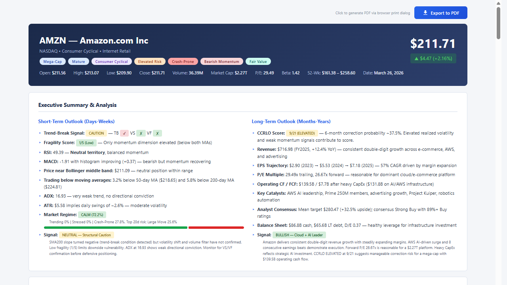
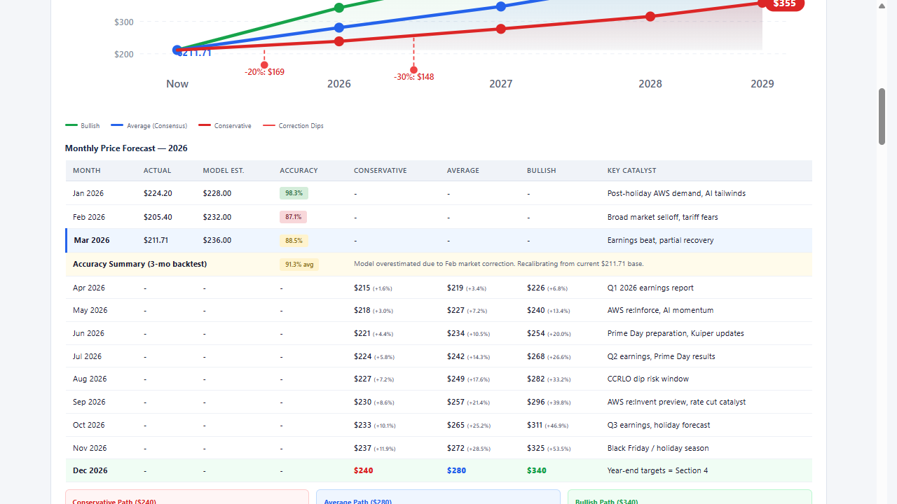
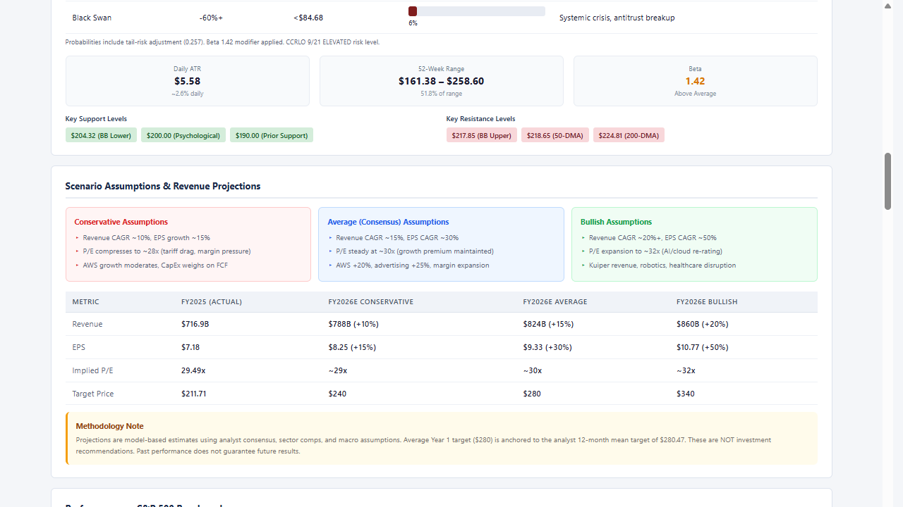
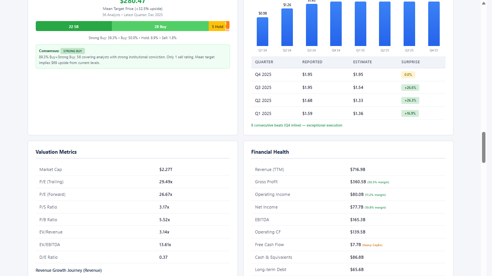

# Market Analysis

AI-powered stock analysis report generator that produces standalone, PDF-exportable HTML reports using real-time data from [Alpha Vantage](https://www.alphavantage.co/) via MCP (Model Context Protocol).

## What It Does

Given a stock ticker, the system:
1. **Collects data** — Fetches 15+ data points from Alpha Vantage (quotes, financials, technicals, sentiment, macro indicators, peer comparisons)
2. **Computes signals** — Runs a Python pipeline that produces short-term trend-break signals, long-term correction risk (CCRLO), event simulations, and stock classification tags
3. **Generates a report** — Builds a 20-section HTML report with interactive SVG charts, signal dashboards, and financial flow diagrams
4. **Validates everything** — Automated numerical audits, signal contract checks, and 7-layer report quality audits

Reports are self-contained HTML files exportable to PDF (A4 landscape).

## Example Reports

### Live Demo (GitHub Pages)

> **[View Live Report Gallery](https://thongton11314.github.io/stock-analysis/docs/)** — Interactive HTML reports rendered in your browser with full SVG charts, hover effects, and PDF export.

| Ticker | Live Demo | Local File | Description |
|---|---|---|---|
| AMZN | [Live](https://thongton11314.github.io/stock-analysis/examples/AMZN-analysis.html) | [examples/AMZN-analysis.html](examples/AMZN-analysis.html) | Amazon — Mega-cap E-commerce & Cloud |
| HOOD | [Live](https://thongton11314.github.io/stock-analysis/examples/HOOD-analysis.html) | [examples/HOOD-analysis.html](examples/HOOD-analysis.html) | Robinhood — Fintech / Digital Brokerage (Gold Standard) |

Each report contains 20 sections including interactive SVG charts, signal dashboards, income statement flow diagrams, and is exportable to PDF (A4 landscape).

### Sample Report Output (AMZN)

**Header & Executive Summary** — Stock classification tags, real-time price, short-term trend-break signals, long-term CCRLO correction risk, and market regime assessment:



**Scenario Projections & S&P 500 Benchmark** — Multi-scenario revenue projections, correction risk table with probability bars, and cumulative return comparison charts:



**Technical Indicators & Signal Dashboard** — RSI gauge, MACD, ADX, ATR tiles, Bollinger Band gradient bar, moving averages, trend-break status, fragility score, market regime bar, and event risk tiles:



**Macro Dashboard & Competitive Landscape** — Fed Funds Rate chart, GDP/CPI/unemployment indicators, macro-equity correlation analysis, and peer comparison tables:



## Quick Start

### Prerequisites
- Python 3.10+
- [Alpha Vantage API key](https://www.alphavantage.co/support/#api-key) (free tier works, 15-min delayed data)
- VS Code with [GitHub Copilot](https://github.com/features/copilot) (for agent-driven workflows)

### Generate a Report

Use the **@stock-analyst** agent in VS Code Copilot Chat:

```
@stock-analyst analyze AMZN
```

This triggers the full pipeline: data collection → signal computation → report generation → audit.

### Run the Compute Pipeline Manually

```bash
# 1. Place your data bundle in scripts/data/TICKER_bundle.json

# 2. Run the unified engine (validates inputs → computes signals → validates outputs)
python scripts/analyst_compute_engine.py --ticker AMZN

# 3. Output signals are written to scripts/output/AMZN_*.json
```

### Run Tests

```bash
# Quick pass — unit + contract tests (135 tests)
python scripts/run_tests.py --suite quick

# Full pass — all 6 suites (183 tests)
python scripts/run_tests.py --suite all
```

## Project Structure

```
market-analysis/
├── .github/
│   ├── copilot-instructions.md     # Auto-loaded project rules for Copilot
│   ├── agents/                     # VS Code Copilot agents
│   │   ├── stock-analyst.agent.md  # Main analysis agent
│   │   ├── test-engineer.agent.md  # System verification agent
│   │   └── portfolio-manager.agent.md
│   ├── skills/                     # Auto-matched skills (13 total)
│   │   ├── data-collection/        # MCP data gathering
│   │   ├── report-generation/      # Full report workflow
│   │   ├── analyst-compute-engine/ # Python signal pipeline
│   │   ├── short-term-analysis/    # Trend-break signals
│   │   ├── long-term-prediction/   # CCRLO correction risk
│   │   ├── simulation/             # Event probability modeling
│   │   ├── stock-tagging/          # 5-dimension classification
│   │   ├── numerical-audit/        # Data accuracy validation
│   │   ├── report-audit/           # 7-layer quality check
│   │   ├── report-fix/             # Diagnose & repair reports
│   │   ├── system-test/            # 183-test verification
│   │   ├── portfolio-build/        # Dashboard generation
│   │   └── portfolio-audit/        # Portfolio validation
│   └── workflows/
│       └── system-guard.yml        # CI: auto-test on push/PR
├── .instructions/                  # Detailed reference specs
│   ├── data-collection.md          # MCP workflow & required data
│   ├── report-layout.md            # Section order & card rules
│   ├── styling.md                  # CSS, themes, PDF export
│   ├── analysis-methodology.md     # Price targets, macro, competitive
│   ├── analysis-reference.md       # Fundamental & technical tables
│   ├── signal-contracts.md         # Signal output schemas
│   ├── short-term-strategy.md      # Trend-break specification
│   ├── long-term-strategy.md       # CCRLO specification
│   ├── simulation-strategy.md      # Event simulation spec
│   └── tag-taxonomy.md             # Stock classification taxonomy
├── scripts/                        # Python computation engine
│   ├── analyst_compute_engine.py   # Unified pipeline orchestrator
│   ├── compute_short_term.py       # TB/VS/VF + Fragility scoring
│   ├── compute_ccrlo.py            # CCRLO 7-feature scoring (0-21)
│   ├── compute_simulation.py       # Regime + event probabilities
│   ├── compute_tags.py             # 5-dimension classification
│   ├── validate_inputs.py          # Pre-computation data gate
│   ├── validate_outputs.py         # Post-computation contract check
│   ├── validate_numbers.py         # 3-stage numerical audit
│   ├── run_tests.py                # Test runner (6 suites, 183 tests)
│   ├── build_portfolio.py          # Portfolio dashboard builder
│   ├── audit_portfolio.py          # Portfolio 8-layer audit
│   ├── portfolio_optimizer.py      # Evidence-based construction
│   ├── data/                       # Data bundles (per ticker)
│   ├── output/                     # Signal outputs (per ticker)
│   └── tests/                      # Test suites + golden references
├── templates/
│   ├── report-template.html        # CSS & structure reference
│   └── portfolio-template.html     # Portfolio dashboard template
├── examples/
│   └── HOOD-analysis.html          # Gold standard reference report
├── reports/                        # Generated reports
├── portfolio-manager/              # Portfolio dashboard
├── strategies/                     # Research documents
└── ARCHITECTURE.md                 # System architecture (Mermaid diagrams)
```

## Signal Pipeline

All signals are computed via Python — never inline by the AI agent.

```
Data Bundle → validate_inputs → compute_short_term → compute_ccrlo → compute_simulation → compute_tags → validate_outputs
```

| Signal | What It Measures | Output |
|---|---|---|
| **SHORT_TERM** | Trend-break (TB), volatility shift (VS), volume filter (VF), fragility (0-5) | `TICKER_short_term.json` |
| **CCRLO** | 6-month correction probability from 7 macro-financial features (score 0-21) | `TICKER_ccrlo.json` |
| **SIMULATION** | Market regime + 6 event probabilities at 5d/10d/20d horizons | `TICKER_simulation.json` |
| **TAGS** | 5-dimension classification: Profile, Sector, Risk, Momentum, Valuation | `TICKER_tags.json` |

## Report Sections (20 Total)

Reports follow an "inverted pyramid" — decision-critical content first:

1. Export Bar
2. Header (ticker, price, OHLCV)
3. Executive Summary & Analysis
4. Price Target Projections
5. Price Corridors & Correction Scenarios
6. Scenario Assumptions & Revenue Projections
7. Performance vs. S&P 500 Benchmark
8. Analyst Consensus + Quarterly EPS
9. Valuation Metrics + Financial Health
10. Income Statement Breakdown (interactive Sankey)
11. Technical Indicators (3-row dashboard + signal tiles)
12. Event Risk Simulation — 20-Day Forward
13. News & Sentiment + Key Risks
14. Shares & Ownership
15. US Economic Indicators — Macro Dashboard
16. Global Market + Macro-Equity Correlation
17. Competitive Landscape
18. Net Macro Environment Scorecard
19. Disclaimer
20. Timestamp

## Agents

| Agent | Trigger | Purpose |
|---|---|---|
| `@stock-analyst` | `analyze [TICKER]` | Full analysis pipeline — data → signals → report → audit |
| `@test-engineer` | `run tests` | System verification, golden reference management |
| `@portfolio-manager` | `build portfolio` | Aggregate dashboard across all analyzed tickers |

## Testing

The test framework covers 183 tests across 6 suites:

| Suite | Tests | Coverage |
|---|---|---|
| Unit: Short-Term | 26 | TB/VS/VF gates, fragility scoring |
| Unit: CCRLO | 22 | Feature extraction, composite scoring |
| Unit: Simulation | 20 | Regime detection, event probabilities |
| Unit: Tags | 45 | 5-dimension classification thresholds |
| Contracts | 22 | Schema validation, golden regression |
| Integration | 12 | Full pipeline E2E, cross-module consistency |
| Docs Consistency | 36 | Architecture & documentation integrity |

```bash
python scripts/run_tests.py --suite quick    # 135 tests, <0.2s
python scripts/run_tests.py --suite all      # 183 tests, <0.5s
python scripts/run_tests.py --golden all     # Regenerate golden references
```

## Data Sources

All market data is fetched from [Alpha Vantage](https://www.alphavantage.co/) via MCP:

- **Stock**: GLOBAL_QUOTE, COMPANY_OVERVIEW, TIME_SERIES_DAILY
- **Financials**: INCOME_STATEMENT, BALANCE_SHEET, CASH_FLOW, EARNINGS
- **Technical**: RSI, MACD, BBANDS, SMA, EMA, ADX, ATR
- **Sentiment**: NEWS_SENTIMENT, INSTITUTIONAL_HOLDINGS
- **Macro**: CPI, FEDERAL_FUNDS_RATE, UNEMPLOYMENT, REAL_GDP

Free tier provides 25 requests/day with 15-minute delayed data.

## License

This project is for internal use. All generated reports include a financial disclaimer stating that content is for informational purposes only and does not constitute investment advice.
