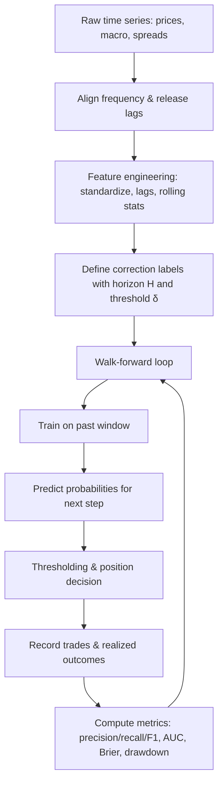
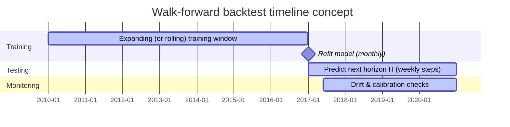

# Providing long-term market-correction prediction strategies with historically high reported classification skill

## Executive summary

Forecasting **market corrections** (commonly defined as a ≥10% drawdown from a recent peak) is fundamentally a *rare-event prediction problem* in most equity indices, which makes superficial “accuracy” claims easy to inflate (e.g., always predicting “no correction” can yield high accuracy when corrections are infrequent). A rigorous research interpretation of “>70% accuracy” therefore must specify (i) what constitutes a correction/crash, (ii) the forward horizon, (iii) the class balance, and (iv) metrics beyond accuracy (precision/recall, F1, ROC/AUC, Brier, calibration, and lead-time performance). citeturn3search24turn29view2turn18view2

Across peer-reviewed and high-quality institutional research that **explicitly evaluates** correction/crash or closely allied “downside regime” prediction, a consistent pattern emerges:

A small set of strategy families repeatedly shows **strong classification skill (≥0.70 AUROC, or ≥70% crisis/correct-event hit-rate under specific definitions)**, but usually with important caveats about (a) event definition (often 15–30% “crashes” rather than 10% “corrections”), (b) in-sample vs rolling out-of-sample, and (c) false-alarm tradeoffs. The most defensible evidence for *longer-horizon* downside prediction comes from (1) valuation-to-fundamentals residual models estimated with logit-type classifiers and evaluated via AUROC/Brier, and (2) credit/term-structure–based probabilistic models (often framed as recession or stress prediction) with high AUROC that can be repurposed as equity-correction risk proxies. citeturn29view0turn29view2turn18view2

Among the surveyed approaches, the following have **documented performance exceeding the user’s >70% skill criterion**, under their *own* definitions:

- A **counterfactual valuation residual + logit** framework shows strong in-sample signal quality (e.g., average AUROC around 0.85 in a reported rolling-evaluation setup for severe year-over-year “crash” thresholds) and improves over simpler alternatives such as dividend yield and momentum in-sample, though out-of-sample results are mixed and strongly episode-dependent. citeturn30view0turn30view3turn29view0turn29view2  
- A **risk-aversion / credit-spread composite (PCA) + logit** early-warning model reports high crisis “correctly predicted” rates (e.g., ~84–88% for “stock market crises” defined via a CMAX-style abnormal drawdown criterion over a one-year warning horizon), but also explicitly notes that the crisis definition often triggers after prices have already fallen meaningfully, and false-alarm ratios can be high. citeturn6view0turn7view1turn4view0  
- A **high-dimensional macro-finance ML classification** approach (monthly) reports very high cross-validation accuracy (mid-90% range) for “crash” labels and low false-discovery rates in-sample/validation; it also shows a walk-forward out-of-sample exercise around a single major episode, while acknowledging accuracy degradation as horizon extends. This evidence supports feasibility but also highlights typical ML pitfalls in finance (imbalance, unstable features, limited independent crises). citeturn13view1turn13view3turn10view0  
- A **daily turbulence early-warning system** combining volatility-regime labeling and a sequential neural predictor reports ~96% test-set accuracy and short (multi-day) lead time, but this is intrinsically **short-horizon** and labels “turbulence” rather than the canonical 10% correction. citeturn16view3turn16view4

On that basis, the report recommends a **practically implementable composite-probability strategy** that stays close to the research-supported ingredients (credit spreads, term spread, volatility, financial conditions) and uses conservative tooling (regularized logistic regression, walk-forward validation, probability calibration, strict leakage controls). It is implementable using primarily **official** macro/financial data from entity["organization","FRED","macro data service | St. Louis Fed"] plus index prices from entity["organization","Yahoo Finance","market data platform | global"] (or licensed datasets like entity["organization","CRSP","security prices database | US"] for institutional-grade long history). citeturn3search22turn3search23turn3search25turn3search28

## Scope, definitions, and design choices requiring explicit decisions

A rigorous correction-prediction system cannot be “constraint-free” in implementation; the items below must be chosen (or a default must be adopted) because they materially change measured accuracy and real-world usefulness:

**Market and tradable instrument choice.** Typical defaults are a broad US equity index for signal construction and an investable proxy (index future or ETF) for execution; alternative markets change data availability and crisis frequency. citeturn32search0turn3search25

**Correction definition.** A common public definition is a ≥10% decline from a recent peak (with ≥20% often called a bear market). Academic/central-bank crash work frequently uses 15–30% (sometimes year-over-year) thresholds or abnormal CMAX-style events. Mixing these definitions invalidates comparisons unless explicitly normalized. citeturn3search24turn7view1turn30view1

**Prediction target and horizon.** Examples include:
- “Will a ≥10% peak-to-trough drawdown occur within the next **H** trading days?” (H = 63, 126, 252).  
- “Will the market **enter** correction territory within the next **H** days?”  
- “Will a ≥X% year-over-year decline start within the next year?” (common in crash EWS research). citeturn30view1turn6view0turn18view2

**Sampling frequency.** Long-horizon models are most defensible at weekly or monthly frequency, especially when using macro series and avoiding microstructure noise; daily-frequency “turbulence” warnings are typically short-horizon by design. citeturn18view2turn16view3turn22view0

**Data realism.** Macro data may be revised; a robust design uses point-in-time vintages when possible (or at minimum acknowledges that using revised data can overstate backtest performance). citeturn27search2turn27search25turn18view2

## Candidate strategies claiming strong correction or crash prediction skill and critique

### Evidence table of candidate strategies

The table below focuses on strategies that (a) explicitly model downside events/regimes and (b) report performance exceeding the “>70%” threshold **in at least one meaningful skill metric** (AUROC ≥0.70, or event hit-rate ≥70% under stated definitions), while noting the strongest limitations that typically prevent naive generalization to 10% corrections.

| Strategy family | Typical event definition | Horizon | Core inputs | Model class | Reported skill exceeding 70% | Primary limitations |
|---|---|---|---|---|---|---|
| Counterfactual valuation residual → crash probability | ≥15–30% “crash” thresholds; often year-over-year drop start dates; excludes post-crash windows to reduce overlap | ~12 months | Price index; earnings proxy (smoothed); residual “mispricing vs through-the-cycle fundamentals”; optional volatility/momentum | Cointegration + logit classifier | Example: average AUROC around 0.85 reported in a rolling evaluation context; in-sample improvement vs alternatives; out-of-sample mixed by subperiod citeturn29view0turn29view2turn30view0turn30view3 | Requires robust earnings series; regime/episode dependence; out-of-sample instability; event rarity makes metrics noisy citeturn29view2turn30view1 |
| Credit-spread/risk-aversion composite → crisis EWS | “Stock market crisis” via abnormal drawdown proxy (CMAX below mean − k·σ) and one-year pre-crisis labeling | 12 months | Equity index price (CMAX); credit spreads/risk premia; optional valuation (P/E), returns, real rates | PCA composite + logit / multilogit | Example: ~84% crises “predicted” (base); replacing PCA with component spreads reported ~88% crises correctly predicted; also notes high false alarms and non-turning-point detection citeturn4view0turn6view0turn7view1turn4view0 | Crisis definition may activate after substantial decline; false-alarm ratio can be large; results often in-sample due to limited crises citeturn7view2turn6view3turn4view0 |
| Macro-finance probabilistic downturn models used as equity-risk proxy | Recession-in-next-12-months (or transition-into-recession) classification (not equity correction directly) | 12 months | Yield-curve spreads, corporate-bond risk sentiment proxy, yield-curve PCs | Probit / binary classifier | Example: AUROC ~0.88 for certain bivariate probit recession models; AUROC exceeds 0.70 across several specifications citeturn18view2 | Target is recession not correction; mapping to market drawdowns is imperfect; policy/regime shifts can alter signal reliability citeturn18view2turn18view1turn25news40 |
| High-dimensional ML early warning | “Crash” months defined by large drawdown threshold (e.g., ≥20%); monthly classification | Up to 3 months (best), degrades beyond | Large macro-finance feature set (e.g., 134-variable macro database) | Supervised ML (linear SVM, tree-based, ensembles) | Example: cross-validation accuracy reported in the mid-90% range; low false-discovery rates for crash predictions in training/validation; includes a walk-forward out-of-sample exercise around a major episode citeturn13view1turn13view3turn10view0 | Class imbalance inflates headline accuracy; limited independent crash episodes; potential leakage if not strictly time-purged; horizon sensitivity citeturn10view0turn13view3 |
| Daily turbulence EWS | High-volatility/turbulence regime “crisis” (volatility-state label), plus onset warning | 1–5 days lead | Index returns, realized volatility; exogenous macro/market factors | Volatility-regime model + sequential predictor | Example: ~96.6% test-set accuracy and onset-warning stats reported, with ~2.4 days average lead-time in one setting citeturn16view3turn16view4 | Not long-term; predicts “turbulence” not canonical 10% corrections; market-specific tuning risk citeturn16view4turn15view0 |

### Interpretation and critique of “>70% accuracy” claims

**Why “accuracy” is often the wrong headline metric.** In many datasets, “no correction” is the majority class; accuracy can exceed 70% even with trivial models. The institutional and academic literature therefore often emphasizes ROC/AUC (threshold-free discrimination), proper scoring rules (Brier, log score), and explicit false-alarm tradeoffs. citeturn18view2turn29view0turn9view3

**Event definitions often differ from the practical 10% correction.** High reported skill is frequently achieved for more severe events (e.g., ≥20% bear markets, ≥25% year-over-year crashes, or volatility-turbulence regimes). These are not interchangeable with a 10% correction; the conditional base-rate changes and so do optimal thresholds. citeturn30view1turn10view0turn16view3

**Some “early warning” setups are not predicting the turning point.** A key critique explicitly made in the credit-spread crisis EWS literature is that a crisis indicator defined via abnormal drawdown can trigger only after a significant decline has already begun; skill measures then partly reflect detecting an ongoing event rather than predicting the onset. citeturn7view2turn4view0

**Out-of-sample evidence is scarce precisely where claims are strongest.** Downside events are rare and clustered; splitting into multiple independent train/test regimes is hard. Several sources therefore either (a) rely on in-sample fitted probabilities due to limited crises, or (b) show rolling evaluations that can be heavily influenced by a small number of episodes. citeturn6view3turn29view2turn13view3

## Model specifications, parameter estimation, and decision rules

This section provides explicit model forms for the main viable strategy families, with concrete decision rules for “predicting a correction.” Where the underlying sources define “crash/crisis” differently, the specification is presented generically, and the translation to a “10% correction within H days” label is made explicit.

### Counterfactual valuation residual logistic model

**Core idea.** Build a valuation benchmark implied by a long-run price–earnings relationship using a smoothed earnings series, then treat deviations (“residual mispricing”) as a predictor of future crash/correction probability in a logit model. citeturn30view0turn30view3turn29view0

**Benchmark and residual.** One documented specification constructs a counterfactual benchmark and residual: citeturn30view0  
\[
\text{CVB}_t = \alpha + \beta \, e^{(10)}_{t-3}, \qquad \varepsilon_t = p_t - \text{CVB}_t
\]
where \(p_t\) is (log) price, \(e^{(10)}_{t-3}\) is a lagged 10-year moving average of (log) earnings, and the lag is used to reduce look-ahead bias (though not eliminate it). citeturn30view0turn30view1

**Crash/correction label (generic form).** Define a binary outcome:
\[
y_t = \mathbf{1}\{\text{Drawdown}_{t \rightarrow t+H} \ge \delta\}
\]
with \(\delta = 0.10\) for a 10% correction, or \(\delta \in [0.15,0.30]\) for more severe events; to reduce overlapping-label autocorrelation one may (i) label only “start dates” and (ii) exclude a post-event window, as documented in crash work. citeturn30view1turn30view3

**Logit model.**
\[
\Pr(y_t=1 \mid x_t) = \sigma(\beta_0 + \beta_1 \varepsilon_t + \beta_2^\top w_t)
\]
where \(w_t\) can include additional predictors (e.g., long-window volatility and price growth), and \(\sigma(u)=\frac{1}{1+e^{-u}}\). citeturn29view2turn30view3

**Parameter estimation.**
- Estimate \(\beta\) in the cointegration/price–earnings relationship with methods such as dynamic OLS or VEC-style models, then construct \(\varepsilon_t\). citeturn30view3  
- Estimate the logit coefficients by maximum likelihood on event start dates with post-event censoring to reduce overlap bias (documented). citeturn30view3turn29view2

**Decision rule (correction warning).**
Given forecast probability \(\hat p_t\), issue a correction alert if:
\[
\hat p_t \ge \tau
\]
where \(\tau\) is selected by optimizing a cost-sensitive metric (e.g., maximize F1 subject to false-alarm constraint, or maximize expected utility net of transaction costs).   citeturn18view2turn29view2

**Known limitations.** Requires a reliable earnings series and careful anti-leakage handling; out-of-sample results can be mixed and sensitive to valuation regime shifts. citeturn29view2turn30view1

### Credit-spread / risk-aversion composite with one-year crisis logit

**Crisis identification via CMAX.** A documented “stock market crisis” rule uses the ratio of current price to the maximum price over a trailing window (e.g., 24 months): citeturn7view1turn7view2  
\[
\text{CMAX}_t = \frac{P_t}{\max(P_{t-24:t})}
\]
and defines crisis months when CMAX is “abnormally low” relative to its mean by a multiple of its standard deviation. citeturn7view1

**One-year early-warning label.** The dependent variable is then constructed as a “pre-crisis” indicator equal to 1 during the 12 months before each crisis and during the crisis itself; post-crisis months can be excluded. This converts the task into “probability of crisis within one year.” citeturn6view0

**Logit EWS model.** A representative specification is: citeturn6view0turn6view2  
\[
\Pr(I_{t}=1\mid X_t) = \sigma\Big(\alpha_0 + \sum_k \alpha_k X_{k,t} + \alpha_{\lambda}\lambda_t\Big)
\]
where \(X_{k,t}\) includes macro/market controls (e.g., valuation proxy, returns, real rates), and \(\lambda_t\) is a risk-aversion indicator (e.g., principal component of multiple credit spreads). citeturn4view0turn6view2

**PCA risk-aversion signal.** If \(S_t \in \mathbb{R}^m\) is a vector of standardized spreads, compute:
\[
\lambda_t = v_1^\top S_t
\]
where \(v_1\) is the first principal-component loading vector estimated on an expanding or rolling window to respect the arrow of time. citeturn4view0

**Decision rule.**
\[
\text{Predict crisis/correction within one year if } \hat p_t \ge \tau
\]
with \(\tau\) tuned for false-alarm tolerance. In documented results, higher hit rates can coincide with substantial false alarms. citeturn4view0turn9view3

**Key critique.** Because the crisis indicator can trigger after declines are “already well under way,” part of the measured “prediction” can be detection of an ongoing drawdown rather than true pre-turn timing. citeturn7view2turn4view0

### Macro-finance probabilistic downturn models as correction-risk proxy

**Core idea.** Use a binary classifier to estimate the probability of a macro downturn within a fixed horizon (commonly 12 months), then treat high downturn probability as an equity correction-risk proxy. This is supported by evidence that term spreads and corporate credit-risk sentiment measures can deliver high out-of-sample discrimination in recession classification tasks. citeturn18view2turn18view1

**Probit model (canonical form).**
\[
\Pr(R_{t,t+12}=1 \mid z_t) = \Phi(\gamma_0 + \gamma^\top z_t)
\]
where \(R_{t,t+12}\) indicates a downturn within the next 12 months and \(z_t\) includes predictors like term spread and corporate-bond risk measures. citeturn18view2

**Reported performance.** A central-bank research note reports AUROC values in the ~0.70–0.88 range depending on specification, including ~0.88 for certain bivariate forms, and even higher AUROC in a “transition-into-recession” framing for some predictors. citeturn18view2

**Decision rule (equity-risk overlay).** Convert recession probability \(\hat p^{\text{rec}}_t\) into an equity correction-risk alert using either:
- a direct threshold \(\hat p^{\text{rec}}_t \ge \tau\), or  
- a 2-stage rule that also requires market-based confirmation (e.g., credit spreads widening above a percentile). citeturn18view2turn27search6

**Limitations.** Not an equity correction model; structural changes to the yield curve’s reliability and policy-market distortions can reduce stability. citeturn18view1turn25news40

### High-dimensional ML classifiers for crash/correction states

**Core idea.** Use a large macro-financial feature set (e.g., 134-series monthly macro database) and train classifiers to label future “crash” states, typically at short horizons; reported accuracy tends to degrade beyond a few months. citeturn10view0turn27search2

**Example model class: linear SVM as probabilistic classifier.** A linear margin classifier has decision function:
\[
s_t = w^\top x_t + b
\]
Convert to calibrated probability via platt-style sigmoid:
\[
\hat p_t = \sigma(a s_t + c)
\]
then apply threshold \(\hat p_t \ge \tau\). Reported cross-validation accuracies for crash classification can exceed 90% in some settings. citeturn13view1turn10view0

**Data inputs.** One documented setup uses a 134-variable macro dataset and groups predictors by category; it also emphasizes that “bad states” occur <20% of the time, making false discovery critical. citeturn10view0turn27search2

**Limitations.** Headline accuracy can be dominated by class imbalance; careful walk-forward testing and leakage control is mandatory. citeturn10view0turn13view3

## Backtesting blueprint for correction prediction

### Datasets and data sources

A practical research-grade backtest commonly uses:

- **Equity index levels / returns.** For long history and clean corporate actions, licensed datasets (e.g., entity["organization","CRSP","security prices database | US"]) are standard; for accessible prototyping, index prices can be sourced from entity["organization","FRED","macro data service | St. Louis Fed"] (noting licensing limits on daily history for certain series) or entity["organization","Yahoo Finance","market data platform | global"] for historical downloads. citeturn3search25turn3search28turn32search0turn32search2turn3search23  
- **Macro/financial predictors.** Term spreads, credit yields/spreads, volatility indices, and stress/conditions indices can be obtained from entity["organization","FRED","macro data service | St. Louis Fed"]. Examples include the 10y–3m term spread series and widely used credit and volatility series. citeturn33search3turn33search2turn33search0turn27search6turn33search1  
- **Large macro panels.** The FRED-based monthly macro “big data” panel (134 series) is documented as a publicly available, regularly updated dataset intended for research replication. citeturn27search2turn27search25  
- **Ground-truth macro regimes (optional).** Recession dates from entity["organization","NBER","economic research organization | US"] are maintained and made available in downloadable formats; entity["organization","FRED","macro data service | St. Louis Fed"] provides corresponding recession indicator series derived from those dates. citeturn27search1turn27search4turn27search16

### Correction-event definitions suitable for backtesting

To align with practical “correction” language while remaining machine-testable, define one of:

**Peak-to-trough drawdown within a forward window (recommended).**
Let \(M_t=\max_{u\le t} P_u\) and drawdown \(D_t = 1 - P_t/M_t\). Define event:
\[
y_t = \mathbf{1}\left\{\max_{s\in (t, t+H]} D_s \ge \delta\right\},
\quad \delta=0.10
\]
This answers: “Will a ≥10% drawdown from the running peak occur within H days?” It matches the popular 10% correction framing while being explicit about horizon. citeturn3search24turn30view1

**Entry-into-correction within forward window.**
Define the first time the drawdown crosses 10% and label only *start dates* to reduce overlap:
\[
y_t = \mathbf{1}\left\{D_t < \delta \ \land\ \exists s\in(t,t+H]: D_s \ge \delta\right\}
\]
and then apply censorship/exclusion windows analogous to crash literature to reduce serial dependence. citeturn30view3turn6view0

**Year-over-year crash starts (aligned to some crash EWS research).**
This is less aligned to the colloquial “correction” definition but appears in institutional crash-probability work and can be used for stress-testing:
\[
y_t = \mathbf{1}\left\{\frac{P_{t+H}}{P_t}-1 \le -\delta_{\text{yoy}}\right\},
\quad \delta_{\text{yoy}}\in[0.15,0.30]
\]
with post-event exclusion windows to prevent overlap. citeturn30view1turn30view3

### Evaluation metrics and procedures

A robust evaluation must report:

- Confusion-matrix metrics: accuracy, precision, recall, F1, and balanced accuracy.  
- Threshold-free discrimination: ROC and AUC (AUROC).  
- Probability quality: Brier score and calibration curves; proper scoring rules are frequently used in crash-probability and recession-probability evaluations. citeturn18view2turn29view0turn9view3

**Walk-forward testing (required).** At time \(t\), fit the model only on data \(\le t\), predict \(t+1\) (or \(t+H\)), advance, and repeat. This is emphasized in applied recession/cycle probability work and is standard for policy-relevant real-time decision settings. citeturn18view2turn13view3turn6view3

**Time-series cross-validation with leakage control.** When labels are defined over forward horizons, adjacent observations share overlapping future information. Use purged or blocked splits so that no training sample’s outcome window overlaps the test sample’s outcome window (a critical control for rare-event horizon labeling). The need to avoid misleading in-sample goodness-of-fit is explicitly emphasized in institutional recession-probability evaluation. citeturn18view2turn30view3



### Backtest timeline and windows

A conservative default is a **weekly** model retrained monthly with an expanding window (or 10–15 year rolling window), and a prediction horizon \(H\) of 13 or 26 weeks for “correction within ~3–6 months.” This matches the reality that macro/financial conditions indices are often weekly/monthly and reduces noise relative to daily prediction. citeturn27search6turn27search2turn18view2



## Practical deployment, risk controls, and monitoring

### Data latency, licensing, and reproducibility

- entity["organization","FRED","macro data service | St. Louis Fed"] requires API keys for programmatic access and has explicit guidance on API key usage. citeturn3search22  
- Some equity index series in entity["organization","FRED","macro data service | St. Louis Fed"] are subject to licensing limits on daily history (documented in series notes). This impacts backtest horizon unless supplemented with licensed datasets. citeturn32search2turn32search7  
- entity["organization","Yahoo Finance","market data platform | global"] provides downloadable historical data and can support prototyping, but production use should review terms, data quality, and survivorship considerations. citeturn3search23

### Transaction costs, slippage, and execution realism

A correction-warning strategy typically acts as a **risk overlay** (e.g., reducing equity exposure, increasing cash/short-duration bonds, or buying protective options). The strategy’s economic value depends less on perfect timing and more on reducing large drawdowns net of trading frictions. Market-timing literature warns that false alarms can be frequent in crisis predictors; controlling turnover is therefore a primary design goal. citeturn4view0turn24view2turn23view3

### Overfitting prevention and model governance

- Use **regularization** (L1/L2) and a small, theory-consistent feature set (credit, term structure, volatility, financial conditions).  
- Prefer **walk-forward evaluation** with strict time ordering; avoid selecting hyperparameters on the full sample. citeturn18view2turn13view3  
- Monitor calibration drift: compare predicted probabilities to realized event frequencies (e.g., reliability diagrams; Brier score). Probability scoring is emphasized in crash-probability and binary-classification evaluation frameworks. citeturn29view0turn9view3  
- Include regime-change diagnostics: the yield curve’s predictive reliability can vary across policy regimes; stress-testing for such instability is recommended in term-spread research. citeturn18view1turn25news40

### Ethical, legal, and disclosure language to include

Any deployment should include language covering:

- **Not investment advice.** Results are informational and educational; no guarantee of performance.  
- **Backtest limitations.** Backtests are hypothetical, sensitive to parameter choices, and may not reflect live trading constraints (costs, liquidity, latency).  
- **Data rights and attribution.** Respect licensing/citation requirements (notably for index data on entity["organization","FRED","macro data service | St. Louis Fed"] and any third-party feeds). citeturn32search7turn3search22turn3search23  
- **Model risk.** Rare-event models can fail abruptly; continuous monitoring and documented change control are required, especially if used by others. citeturn18view2turn29view2

## Reference implementation: selected composite strategy, pseudocode, hyperparameters, and skill.md

### Selected strategy

**Strategy name (implementable): Composite Correction Risk Logit Overlay (CCRLO).**

**Goal.** Predict whether the market will experience a ≥10% correction within a forward horizon \(H\) (default: 126 trading days ≈ 6 months), and dynamically reduce equity exposure when predicted correction probability is high.

**Why this strategy is selected from the evidence base.**
- It uses a **logit probability model** (as used in multiple early-warning strands) with **credit, term spread, volatility, and financial conditions** predictors that are repeatedly featured in crisis/stress and downturn probability modeling. citeturn6view0turn18view2turn4view3  
- It is **implementable with mostly official data** from entity["organization","FRED","macro data service | St. Louis Fed"] (term spread, credit yields/spreads, volatility index, financial conditions index), plus index prices from entity["organization","FRED","macro data service | St. Louis Fed"] or entity["organization","Yahoo Finance","market data platform | global"]. citeturn33search3turn33search2turn33search0turn27search6turn32search0turn3search23  
- It avoids requiring proprietary earnings series, while still reflecting a core insight of strong-performing early-warning research: **downside risk rises when credit risk/conditions and implied volatility tighten materially.** citeturn4view0turn18view2turn27search6

### Model specification

Let weekly time index \(t\) (end-of-week). Define features:

- \(x_{1,t}\): term spread \(T10Y3M_t\) (10y minus 3m). citeturn33search3  
- \(x_{2,t}\): credit risk proxy, e.g., high-yield OAS \(HY_t\) (ICE BofA HY OAS). citeturn33search1  
- \(x_{3,t}\): investment-grade credit proxy, e.g., Moody’s Baa yield \(BAA_t\) (or spread variants). citeturn33search2turn33search6  
- \(x_{4,t}\): implied volatility \(VIX_t\). citeturn33search0  
- \(x_{5,t}\): financial conditions \(NFCI_t\). citeturn27search6  
- \(x_{6,t}\): price momentum (12-month total return proxy or price return, computed from index levels). citeturn32search0turn32search2  
- \(x_{7,t}\): realized volatility over last 13 weeks (computed from weekly returns).

Standardize each feature using *only past data* (expanding or rolling z-score):
\[
\tilde x_{j,t} = \frac{x_{j,t}-\mu_{j,t}}{\sigma_{j,t}}
\]

Define the correction label:
\[
y_t = \mathbf{1}\{\max_{s\in(t,t+H]} \text{Drawdown}_s \ge 0.10\}
\]
computed on daily prices but aligned to weekly decision times (features as of week end). citeturn3search24turn30view1

Fit a regularized logistic regression:
\[
\hat p_t = \Pr(y_t=1\mid \tilde x_t) = \sigma\left(\beta_0 + \sum_{j=1}^7 \beta_j \tilde x_{j,t}\right)
\]

**Parameter estimation.**  
Use maximum likelihood with elastic-net penalty (to reduce overfitting and stabilize coefficients), refit monthly on an expanding window, and calibrate probabilities (e.g., isotonic regression) using a trailing validation window. This is consistent with the broader emphasis in institutional probability-model evaluation on out-of-sample classifier performance rather than in-sample fit. citeturn18view2turn29view2

### Decision rule and portfolio overlay

Let equity weight \(w_t \in [0,1]\). Use a two-threshold hysteresis rule to reduce churn:

- If \(\hat p_t \ge \tau_{\text{risk-on→risk-off}}\), set \(w_t = w_{\min}\) (e.g., 0.2).  
- Else if \(\hat p_t \le \tau_{\text{risk-off→risk-on}}\), set \(w_t = w_{\max}\) (e.g., 1.0).  
- Else keep prior \(w_{t}=w_{t-1}\).

This explicitly controls turnover, important because EWS-style models can generate frequent false alarms. citeturn4view0turn23view3

### Default hyperparameters (explicit)

- Frequency: weekly decision, daily label computation  
- Horizon \(H\): 126 trading days (≈ 6 months)  
- Training window: expanding starting at 15 years of history (or 10 years minimum if limited)  
- Regularization: elastic net with \(l1\_ratio = 0.5\); \(C\) chosen by walk-forward validation  
- Calibration: isotonic on trailing 5-year window  
- Thresholds: \(\tau_{\text{risk-on→risk-off}} = 0.35\), \(\tau_{\text{risk-off→risk-on}} = 0.25\) (to be tuned by maximizing F1 subject to max false-alarm rate constraint)  
- Equity weights: \(w_{\max}=1.0\), \(w_{\min}=0.2\)  
- Refit schedule: monthly (first trading day after month-end)  
- Execution assumption: rebalance at next close after signal evaluation

### Pseudocode

```text
Inputs:
  - Daily price series P[d]
  - Weekly macro/financial series:
      T10Y3M[t], HY_OAS[t], BAA[t], VIX[t], NFCI[t]
  - Hyperparameters H, zscore_window, retrain_freq, thresholds

Precompute:
  - Weekly returns r_w[t] from P
  - Momentum mom12[t] = (P_week[t] / P_week[t-52]) - 1
  - Realized vol rv13[t] = stdev(weekly_returns over last 13 weeks)

Label construction (weekly):
  For each week t:
     future_prices = daily P in (week_end[t], week_end[t] + H trading days]
     drawdown_future = max_peak_to_trough_drawdown(future_prices)
     y[t] = 1 if drawdown_future >= 0.10 else 0

Feature matrix:
  X[t] = [T10Y3M[t], HY_OAS[t], BAA[t], VIX[t], NFCI[t], mom12[t], rv13[t]]

Walk-forward backtest:
  Initialize position weight w = 1.0
  For each week t in chronological order:
     If t is a retrain date:
        - Build training set up to t-1
        - Standardize features using only training history
        - Fit elastic-net logistic regression
        - Calibrate probabilities on trailing validation window (optional)
     - Compute standardized features for t
     - p_hat = model.predict_proba(X[t])
     - If p_hat >= tau_hi: w = w_min
       Else if p_hat <= tau_lo: w = w_max
       Else: w unchanged
     - Record portfolio return for week t+1 based on w and asset returns
     - Store prediction p_hat and realized label y[t] for metrics

Evaluate:
  - Classification: Precision/Recall/F1, ROC/AUC, Brier
  - Trading: CAGR, drawdown, turnover, cost-adjusted performance
```

### Complete `skill.md` file content for an AI agent

```markdown
# skill.md — Composite Correction Risk Logit Overlay (CCRLO)

## Objective
Implement, backtest, and monitor a probabilistic risk-overlay strategy that predicts whether a >=10% equity market correction will occur within a forward horizon H and reduces equity exposure when predicted risk is elevated.

This system is for research and informational use only. It is not investment advice.

## Strategy Summary
- Frequency: weekly decisions (end-of-week), daily prices for label computation
- Target: y[t] = 1 if max peak-to-trough drawdown within next H trading days >= 10%
- Model: regularized logistic regression (elastic net), optionally probability-calibrated
- Decision: hysteresis thresholds to reduce turnover

## Required Design Choices (must be set explicitly)
- Market / index proxy:
  - Prototype: S&P 500 price index (SP500 from FRED) or ^GSPC from Yahoo Finance
  - Institutional: CRSP index series or total return series
- Horizon H (default 126 trading days)
- Execution instrument (SPY/ES futures/etc.) and cost model
- Rebalance timing (close/open) and handling of holidays
- Threshold optimization objective (F1 vs cost-weighted utility)

## Data Feeds (minimal official-first set)
### Prices
Option A (official macro platform; limited daily history):
- FRED: SP500 (daily close; note: not total return)

Option B (prototype market platform):
- Yahoo Finance historical download (CSV / API wrapper) for ^GSPC or SPY

### Predictors (FRED series codes)
- Term spread:
  - T10Y3M  (10Y minus 3M Treasury constant maturity spread)
- Credit:
  - BAA     (Moody's seasoned Baa corporate bond yield)
  - (Optional) AAA or spreads such as BAA10Y
  - BAMLH0A0HYM2 (ICE BofA US High Yield Index Option-Adjusted Spread)
- Volatility:
  - VIXCLS  (CBOE VIX)
- Financial conditions:
  - NFCI    (Chicago Fed National Financial Conditions Index)
- Optional regime labels / macro truths (for diagnostics):
  - USREC (NBER-based recession indicator)

### API Access
- FRED API requires an API key.
  - Store in environment variable: FRED_API_KEY
  - Use HTTPS endpoints:
    - https://api.stlouisfed.org/fred/series/observations?series_id=VIXCLS&api_key=...&file_type=json

## Implementation Tasks
### Data ingestion
1. Build a data module that:
   - Pulls FRED series via API and caches locally (parquet)
   - Ingests daily prices (FRED or Yahoo Finance) and stores adjusted close if available
2. Align all series to a weekly calendar (e.g., Friday close):
   - Weekly features computed using last observation in week
   - Missing data handling: forward-fill for macro series only if it matches real release behavior

### Feature engineering
Compute weekly features:
- term_spread = T10Y3M
- hy_oas = BAMLH0A0HYM2
- baa = BAA
- vix = VIXCLS
- nfci = NFCI
- mom12 = P_week[t] / P_week[t-52] - 1
- rv13 = stdev(weekly returns over last 13 weeks)

Standardization:
- z-score each feature using only historical data in the training window
- Keep a record of rolling means/stds used for each prediction timestamp (auditability)

### Label engineering (anti-leakage critical)
Given weekly timestamp t at week_end_date:
- Look forward H trading days in daily price series
- Compute max peak-to-trough drawdown in that forward window
- y[t] = 1 if drawdown >= 0.10 else 0
- Optional: label only first entry into correction (start-date labeling) and apply post-event exclusion window

### Model training
- Use elastic-net logistic regression:
  - penalty = elasticnet
  - l1_ratio = 0.5 (default)
  - C tuned via walk-forward validation
- Refit schedule: monthly
- Calibration (optional but recommended):
  - isotonic regression on trailing 5-year window
  - output calibrated probabilities

### Decision logic
Hysteresis thresholds:
- tau_hi = 0.35 (risk-on -> risk-off)
- tau_lo = 0.25 (risk-off -> risk-on)
Weights:
- w_max = 1.0, w_min = 0.2
Rebalance:
- apply weight for next week’s return (define exact execution assumptions)

### Backtesting engine
- Walk-forward simulation:
  - No use of future data in standardization or training
  - Store per-timestamp prediction, features snapshot hash, model coefficients, thresholds
- Include transaction cost and slippage model:
  - fixed bps + variable (turnover * bps)
  - report turnover and cost drag separately

## Evaluation
### Classification metrics (weekly)
- Confusion matrix, accuracy, precision, recall, F1
- ROC/AUC
- Brier score and calibration curve

### Trading metrics
- CAGR, volatility, Sharpe
- Maximum drawdown
- Tail metrics: CVaR, worst N-week loss
- Regret vs buy-and-hold
- Sensitivity to cost assumptions

### Cross-validation protocol
- Purged / blocked time-series splits:
  - ensure label windows do not overlap between train and test
- Hyperparameter tuning only on past data

## Monitoring & Model Risk Controls
- Data quality monitors:
  - missingness, stale updates, abnormal jumps
- Prediction monitors:
  - probability distribution drift
  - calibration drift (Brier rolling window)
- Performance monitors:
  - rolling AUC, rolling F1
  - drawdown alarms and turnover alarms
- Change control:
  - version datasets, features, labels, model coefficients
  - require review before live threshold changes

## CI/CD Notes
- Add unit tests for:
  - drawdown label computation
  - weekly alignment logic
  - no-leakage assertions (e.g., training cutoffs)
- Add integration tests:
  - fetch latest FRED data with mocked API
  - reproduce a short known backtest window deterministically
- Pipeline:
  - lint + tests -> build -> run backtest smoke test -> publish metrics report artifact
- Artifacts:
  - metrics.json, equity_curve.csv, predictions.parquet, model_card.md

## Disclaimers (must be included in any output/report)
- This is not investment advice and not a recommendation to trade.
- Backtests are hypothetical and may not reflect live execution.
- Data providers have licensing/attribution requirements; users must comply.
- Rare-event prediction is inherently unstable; performance can degrade abruptly.
```

### Dataset and metric comparison tables requested

**Dataset options (typical choices).**

| Data component | Official / institutional option | Prototype option | Notes |
|---|---|---|---|
| Equity returns | Licensed security/index databases (e.g., entity["organization","CRSP","security prices database | US"]) citeturn3search25turn3search28 | entity["organization","Yahoo Finance","market data platform | global"] downloads citeturn3search23 | Institutional sources reduce survivorship/corporate-action issues |
| Macro/predictors | entity["organization","FRED","macro data service | St. Louis Fed"] series and API citeturn3search22turn33search3turn33search2turn33search0turn27search6 | Same | Also supports large macro panels (FRED-MD) citeturn27search2turn27search25 |
| Stress/conditions indices | OFR stress index methodology (institutional) citeturn4view3 and Chicago Fed NFCI citeturn27search6turn27search3 | Same | Stress indices are often “nowcasting” stress rather than long-horizon forecasting |

**Performance metrics (what to report, and why).**

| Metric | What it measures | Why it matters for corrections |
|---|---|---|
| Accuracy | Overall correct classifications | Can be misleading with rare events citeturn10view0turn18view2 |
| Precision / Recall / F1 | False-alarm control vs missed-event control | Stakeholders usually care about missed corrections and alarm fatigue differently citeturn10view0turn4view0 |
| ROC/AUC | Threshold-free discrimination | Widely used in institutional recession/crash probability evaluations citeturn18view2turn29view0 |
| Brier score | Probability calibration quality | Essential for probability-based risk overlays citeturn29view0turn9view3 |
| Lead-time stats | How early warnings occur before onset | Some EWS work emphasizes this as practical value citeturn16view3turn13view3 |

