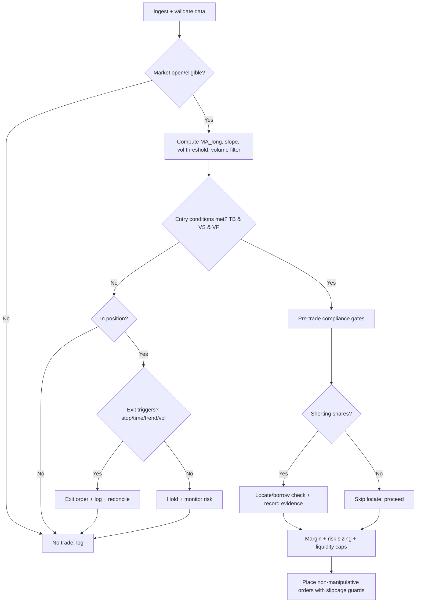

# Formalizing a Trend-Break Risk-Off Short Strategy and AI Agent Skill Specification

## Executive summary

Formalizing a “trend-break risk-off short” strategy means specifying two conditions that must *jointly* hold before initiating a bearish position: (i) a **long-horizon trend break** (price falls below a long moving-average trend proxy with downside confirmation) and (ii) a **volatility regime shift** (a volatility proxy moves into a high-volatility state, preferably defined relative to its own history). The purpose of the second gate is to reduce false entries from routine “dip below trend” events that occur without stress. Evidence for medium-horizon trend persistence exists across asset classes in academic work on time-series trend/momentum, but that evidence is debated; rigorous implementations should therefore be parameter-robust and should explicitly track false-positive rates (loss trades, fast reversals, and whipsaws) rather than assuming a stable edge. citeturn5search0turn5search2

In U.S. markets, implementing the strategy via **short sales of equities/ETFs** requires operational compliance with short-sale locate and recordkeeping expectations (Regulation SHO) before effecting short sales, and it requires margin constraints that can bind during volatility spikes. The SEC’s short-sale rulemaking and discussion of locate requirements emphasizes that broker-dealers must “locate” securities available for borrowing and document compliance before effecting a short sale. citeturn2search4turn2search1

Margin and sizing must incorporate: (a) initial margin conventions (e.g., a “typical unhedged short sale” requiring 150% of proceeds—proceeds plus an additional 50%—per Regulation T interpretations) and (b) maintenance margin floors and per-share minimums (e.g., for stocks short at $5 or above, $5/share or 30% of market value, whichever is greater, under FINRA Rule 4210). citeturn0search2turn0search0

Finally, compliance guardrails must explicitly exclude deceptive or manipulative conduct. Exchange Act Section 9 prohibits transactions intended to create false or misleading appearances (including wash trades and matched orders), and Rule 10b‑5 prohibits fraudulent or deceptive schemes or materially misleading statements/omissions in connection with securities transactions. citeturn1search3turn1search0

## Formal strategy specification with formulas, parameters, and defaults

### Observable inputs

Let the strategy operate on a broad-market tradable proxy (e.g., a liquid index ETF or index future). Define daily observations at market close:

- \(P_t\): close price (or settlement) on day \(t\)
- \(Vol_t\): traded volume on day \(t\) (for ETFs/equities)
- \(V_t\): volatility-regime proxy on day \(t\), typically either:
  - **Implied-vol index proxy**: VIX-level proxy whose methodology is derived from S&P 500 index option quotes, or
  - **Realized volatility proxy** computed from returns

For the implied-vol gate, the **VIX** concept is defined as a near-term volatility expectation derived from S&P 500 (SPX) option bid/ask quotes; contract specifications describe the 30‑day constant-maturity construction from a band of SPX option expirations. citeturn4search3turn3search3  
For historical and QA environments, daily close series for broad indexes and VIX are commonly retrieved via the Federal Reserve Bank of St. Louis’ FRED series pages (noting licensing constraints may limit available daily history for some index series). citeturn3search7turn3search3turn3search6

### Core indicators

**1) Long-horizon trend estimate (simple moving average)**  
Choose a long window \(L\) (trading days), typically \(L \in [150, 300]\).

\[
MA^{(L)}_t = \frac{1}{L}\sum_{i=0}^{L-1} P_{t-i}
\]

**2) Downside confirmation via trend slope**  
Choose a slope lag \(s\) (days), typically \(s \in [10, 30]\).

\[
\Delta MA^{(L)}_t = MA^{(L)}_t - MA^{(L)}_{t-s}
\]

**3) Volatility regime threshold (percentile gate, recommended for robustness)**  
Choose a lookback \(B\) (days) and percentile \(q\) (0–1). Typical: \(B=252\) trading days; \(q \in [0.75,0.90]\).

\[
Q^{(q,B)}_t = \mathrm{Quantile}_q\left(\{V_{t-B},\ldots,V_{t-1}\}\right)
\]

Volatility regime shift indicator:

\[
VS_t = \mathbb{1}\{V_t \ge Q^{(q,B)}_t\}
\]

**4) Volume confirmation (optional but recommended for ETFs/equities)**  
Choose \(N_v \in [10, 30]\) and multiplier \(m \in [1.0, 1.5]\).

\[
VMA^{(N_v)}_t = \frac{1}{N_v}\sum_{i=0}^{N_v-1} Vol_{t-i}
\]
\[
VF_t = \mathbb{1}\{Vol_t \ge m\cdot VMA^{(N_v)}_t\}
\]

### Entry rule

Define a small “buffer” \(b \in [0, 0.02]\) to reduce noise (0–2% below the long MA).

Trend-break indicator:

\[
TB_t = \mathbb{1}\left\{P_t \le (1-b)\cdot MA^{(L)}_t\right\}\cdot \mathbb{1}\left\{\Delta MA^{(L)}_t < 0\right\}
\]

**Enter short** at \(t+1\) (next session) if:

\[
Entry_t = TB_t \cdot VS_t \cdot VF_t
\]

Operationally, executing at \(t+1\) avoids look-ahead if signals are computed on closing data.

### Exit rules

Use a **multi-trigger exit** to control squeeze/whipsaw risk and to avoid “holding and hoping.”

Define:
- Stop-loss distance \(\delta \in [0.05, 0.12]\) (5–12% adverse move) for index/ETF shorts.
- Maximum holding period \(H \in [20, 90]\) trading days.
- Optional “recovery” MA: \(MA^{(E)}_t\) with \(E\in [20, 100]\).

Let \(P_{entry}\) be the fill price at entry, and \(h_t\) the holding days elapsed.

Exit triggers on day \(t\):

- **Stop-loss (short adverse move)**:
  \[
  Exit^{stop}_t = \mathbb{1}\{P_t \ge (1+\delta)\cdot P_{entry}\}
  \]
- **Time stop**:
  \[
  Exit^{time}_t = \mathbb{1}\{h_t \ge H\}
  \]
- **Trend recovery** (choose one conservative form):
  \[
  Exit^{trend}_t = \mathbb{1}\{P_t \ge MA^{(L)}_t\} \quad \text{or} \quad \mathbb{1}\{P_t \ge MA^{(E)}_t\}
  \]
- **Volatility normalization** (optional, to avoid overstaying after vol shock mean-reverts):
  \[
  Exit^{vol}_t = \mathbb{1}\{V_t \le SMA_{n_V}(V)_t\}
  \]
  with \(n_V \in [10, 30]\).

**Final exit condition** (exit if any trigger fires):
\[
Exit_t = \max\left(Exit^{stop}_t, Exit^{time}_t, Exit^{trend}_t, Exit^{vol}_t\right)
\]

### Position sizing under a risk budget and margin constraints

Let:
- \(E_t\): account equity (net liquidation value) at time \(t\)
- \(r\): per-trade risk budget fraction, typical \(r\in[0.0025, 0.02]\) (0.25%–2.0%)
- \(\delta\): stop-loss fraction as above

**Risk-budget notional sizing (stop-distance sizing)**:
\[
\text{Notional}^{risk}_t = \frac{r\cdot E_t}{\delta}
\]

**Gross leverage cap**:
\[
\text{Notional}^{lev}_t = \lambda_{max}\cdot E_t
\]
with \(\lambda_{max}\in[0.5, 1.5]\) depending on instrument and mandate.

**Liquidity cap (execution realism)**:
\[
\text{Notional}^{liq}_t = \alpha \cdot ADV_t
\]
where \(ADV_t\) is average daily dollar volume; typical \(\alpha\in[0.01,0.05]\) (1–5%) for very liquid ETFs, lower for less liquid instruments.

**Margin cap (short equities/ETFs)**  
Two layers matter:

- **Initial margin convention**: a typical unhedged short sale may require margin equal to 150% of short-sale proceeds (proceeds plus an additional 50%) under Regulation T interpretations. This implies an additional-deposit fraction \(m_{init}\approx 0.50\) as a baseline convention (brokers can impose higher “house” requirements). citeturn0search2
- **Maintenance margin floor**: FINRA Rule 4210 specifies, for stock short at \( \ge \$5\), a maintenance requirement of \( \$5\) per share **or** 30% of current market value, whichever is greater. citeturn0search0

Practical sizing should enforce the broker’s current requirements as direct inputs:
- \(MR^{init}_t\): broker’s initial “equity required / short market value” fraction (house margin)
- \(MR^{maint}_t\): broker’s maintenance fraction (house or regulatory floor)

Then:
\[
\text{Notional}^{margin}_t = \min\left(\frac{E_t}{MR^{init}_t}, \frac{E_t}{MR^{maint}_t}\right)
\]

**Final position size (notional)**:
\[
\text{Notional}_t = \min\left(\text{Notional}^{risk}_t,\ \text{Notional}^{lev}_t,\ \text{Notional}^{liq}_t,\ \text{Notional}^{margin}_t\right)
\]

If trading a short-sale instrument that does **not** require borrow (e.g., index futures), replace borrow constraints with exchange/broker margin inputs; still enforce leverage and risk caps.

### Default parameter set (baseline)

A defensible baseline (daily-close signals) for broad-market proxies:

| Component | Symbol | Default | Range | Rationale |
|---|---:|---:|---:|---|
| Long MA window | \(L\) | 200 | 150–300 | Long-horizon trend proxy; relates to medium-horizon persistence documented in time-series trend research, but should be stress-tested due to contested evidence citeturn5search0turn5search2 |
| Buffer under MA | \(b\) | 0.005 | 0–0.02 | Avoid micro-whipsaws around MA |
| Slope lag | \(s\) | 20 | 10–30 | Requires MA to be rolling downward |
| Vol percentile | \(q\) | 0.80 | 0.75–0.90 | Defines “high vol regime” relative to 1y history |
| Vol lookback | \(B\) | 252 | 126–504 | One trading year; robust percentile estimates |
| Volume window | \(N_v\) | 20 | 10–30 | Smooths volume noise |
| Volume multiplier | \(m\) | 1.0 | 1.0–1.5 | Optional confirmation of active selling |
| Stop-loss | \(\delta\) | 0.08 | 0.05–0.12 | Controls squeeze risk; calibrate to instrument vol |
| Time stop | \(H\) | 60 | 20–90 | Avoids indefinite carry in chop |
| Risk budget | \(r\) | 0.01 | 0.0025–0.02 | Standard fixed-fraction risk control |
| Max gross leverage | \(\lambda_{max}\) | 1.0 | 0.5–1.5 | Conservative for short exposure without mandate |

## Pseudocode and executable logic with operational pre-trade checks

The following describes *executable logic* for a daily-close system that trades at the next session’s open (or via a marketable limit near open), while explicitly incorporating borrow/locate, margin, and data-quality checks.

```pseudo
SCHEDULE:
  Run daily after official close + after data arrival (T+minutes).
  Trade window: next session open (or defined intraday execution window).

INPUT FEEDS (daily unless noted):
  - Price OHLCV for instrument X (close required; volume used if available).
  - Volatility proxy V_t:
      * implied vol index (e.g., volatility index level) OR
      * realized vol from returns
  - Borrow/locate status for X (if shorting equity/ETF shares):
      * locate availability, borrow rate, hard-to-borrow flag
  - Margin requirements from broker:
      * initial and maintenance margin fractions for X
  - Corporate actions + trading status:
      * halts, symbol changes, special distributions

DATA VALIDATION:
  if any required input is missing OR stale OR not aligned in timezone:
      raise DATA_ERROR and do not trade
  if trading halt OR not in continuous session:
      do not place new orders

COMPUTE INDICATORS:
  MA_long = SMA(P_close, L)
  MA_slope = MA_long - MA_long.shift(s)
  vol_threshold = rolling_quantile(V, lookback=B, q=q)
  volume_ok = (Vol >= m * SMA(Vol, Nv))  // optional

SIGNALS:
  trend_break = (P_close <= (1-b)*MA_long) AND (MA_slope < 0)
  vol_shift = (V >= vol_threshold)
  entry_signal = trend_break AND vol_shift AND (volume_ok OR volume filter disabled)

  exit_trend = (P_close >= MA_long) OR (P_close >= SMA(P_close, E))  // choose one
  exit_vol   = (V <= SMA(V, nV))  // optional
  exit_time  = (holding_days >= H)
  exit_stop  = (P_close >= entry_price*(1+delta))  // short stop

  exit_signal = exit_trend OR exit_vol OR exit_time OR exit_stop

PRE-TRADE COMPLIANCE CHECKS (must pass to proceed):
  - confirm strategy will not place orders intended to mislead (no wash/matched/spoof patterns)
  - confirm there is no use of material nonpublic info
  - if instrument is equity/ETF shares:
      * confirm locate availability before short sale (Reg SHO workflow)
      * record locate confirmation-id and timestamp

RISK + SIZING:
  risk_notional = (risk_budget * equity) / delta
  lev_notional  = max_gross_leverage * equity
  liq_notional  = alpha * ADV_dollar

  margin_notional = min(equity / MR_init, equity / MR_maint)  // from broker feed
  target_notional = min(risk_notional, lev_notional, liq_notional, margin_notional)

ORDER PLACEMENT (non-manipulative execution):
  if entry_signal AND currently_flat:
      place SELL_SHORT order for target_notional using:
         - primary: limit order near open (marketable limit with slippage guard)
         - alternative: staged limit orders over a short time window
      log expected slippage assumption and fill outcomes

  if exit_signal AND currently_short:
      place BUY_TO_COVER order for current position using:
         - limit or marketable limit, consistent with best execution and urgency

POST-TRADE:
  - reconcile fills vs NBBO where applicable
  - compute realized slippage = (fill_price - reference_price)/reference_price
  - update logs, risk, and monitoring dashboards
```

Key operational considerations for the above checks are grounded in official rulemaking and compliance guidance:
- Reg SHO locate and documentation expectations, as discussed in SEC short-sale materials and adopting releases. citeturn2search4turn2search1
- Avoiding conduct prohibited under Exchange Act Section 9 (false/misleading appearance via wash trades/matched orders). citeturn1search3
- Avoiding fraud/deception under Rule 10b‑5. citeturn1search0

## Risk management framework

### Margin-aware exposure control

For short equity/ETF positions, two widely cited constraints are:

- **Initial margin convention** for a typical unhedged short sale: margin equal to 150% of proceeds (proceeds plus an additional 50%), per Regulation T staff interpretations. citeturn0search2  
- **Maintenance margin floors** under FINRA Rule 4210, including (for short stock at \( \ge \$5\)) \( \$5\)/share or 30% of current market value, whichever is greater. citeturn0search0  

Because brokers can impose stricter “house” requirements, the agent should treat broker-delivered margin parameters as the binding constraints and should recompute **max allowable notional** daily (and intra-day during stress if the broker updates requirements).

### Dynamic sizing under drawdowns and volatility

To avoid “death by 1,000 cuts” in choppy regimes:

- **Drawdown throttle**: reduce \(r\) (risk budget fraction) as equity drawdown deepens; e.g., piecewise \(r\) scaling such as \(r_t = r_0 \cdot \max(0.25, 1 + DD_t)\) where \(DD_t\) is current drawdown (negative).  
- **Volatility-aware stop calibration**: replace fixed \(\delta\) with ATR/realized-vol scaling so the stop is neither too tight in high vol nor too wide in low vol.

These are model-design choices; they are not mandated by regulation, but they align with the reality that volatility regimes can change abruptly (the strategy’s own premise).

### Stop rules hierarchy and gap handling

Because overnight gaps can skip stop levels, the agent should define:

- **Hard stop**: if \(P_t\) breaches the stop threshold at close, exit at next open with urgency.
- **Intraday stop** (if implementing intraday monitoring): trigger a marketable limit to exit immediately when stop is touched.
- **Disaster control**: if price gaps beyond stop by more than \(g\%\), forcibly flatten and open a post-mortem; do not “double down.”

### Scenario stress tests (agent must run in simulation)

At minimum, stress the following scenarios:

- **Fast mean reversion squeeze**: +5% to +10% multi-day rally after entry while volatility remains elevated.
- **Volatility spike + margin tightening**: rapid increase in broker margin requirements causing reduced capacity.
- **Liquidity drop**: widening spreads and lower depth at the open and near close.
- **Data outage**: missing vol proxy or stale price feed on a decision day.

The agent should reject new entries when it cannot validate critical inputs.

## Compliance checklist and operational guardrails

### Core U.S. constraints most relevant to this strategy

- **Regulation SHO (locate + documentation)**: SEC short-sale rules and releases describe that broker-dealers must “locate” securities available for borrowing before effecting a short sale, and require documentation of compliance. citeturn2search4turn2search1  
- **Anti-manipulation (Exchange Act Section 9)**: prohibits transactions intended to create false or misleading appearances of active trading or market conditions, including transactions with no change in beneficial ownership and matched-order style conduct. citeturn1search3  
- **Anti-fraud (Rule 10b‑5)**: prohibits employing schemes to defraud or making materially false/misleading statements or omissions in connection with securities transactions. citeturn1search0  
- **Offering-related short-sale constraint (Rule 105, if applied to single names)**: SEC compliance guidance describes Rule 105 restrictions around short selling in the restricted period and purchasing in offerings, emphasizing its prophylactic application irrespective of intent. (This is typically more relevant to single-name event trading than to broad index hedges, but an agent should still include a Rule 105 “not applicable / applicable” check.) citeturn2search0turn2search3  

### Operational guardrails (non-exhaustive)

The agent should implement explicit “refuse to act” gates for:
- Any instruction to place orders intended to create misleading prints, volume, or apparent supply/demand (prohibited conduct under Section 9). citeturn1search3  
- Any trade actions tied to false statements, rumors presented as facts, or other deceptive messaging associated with trading activity (Rule 10b‑5 risk). citeturn1search0  
- Any short entry when locate status is “unavailable” for equity/ETF shorts, or when locate evidence cannot be recorded (Reg SHO workflow). citeturn2search4turn2search1  

## Observables and required data feeds with data-quality notes

### Primary/official data sources to prioritize

- **Equity/ETF trades and quotes (U.S.)**: consolidated tape and quotation plans (CTA/CQ for exchange-listed; UTP plan for Nasdaq-listed) are described via FINRA’s National Market System Plans overview, which points to the consolidated SIP framework. citeturn9search3  
- **Options consolidated feed**: the SEC’s OPRA materials describe the Options Price Reporting Authority as the SIP consolidating options quotation and transaction information across participant exchanges. citeturn9search0  
- **Volatility index reference**: Cboe materials describe the volatility index as derived from S&P 500 option bid/ask quotes and constructed to a constant 30‑day measure using a range of expirations. citeturn4search3turn4search1  
- **Historical series (QA, research)**: daily close series for broad indexes and volatility proxies are typically retrieved through FRED series endpoints; notes on the series document frequency, timing, and source publishers. citeturn3search7turn3search3turn3search6  

### Non-price operational feeds required for live trading

- **Borrow/locate availability** (equity/ETF shorts): must come from broker/prime or a securities-lending desk; the agent should treat this as a required real-time input because SEC rules emphasize locate before effecting short sales. citeturn2search4turn2search1  
- **Margin requirements**: broker-provided margin parameters (initial + maintenance) must be ingested as first-class inputs; FINRA maintenance floors provide regulatory baselines but brokers may increase requirements. citeturn0search0turn0search2  
- **Options chain data** (if using implied-vol/skew inputs): OPRA-based feed (or a vendor legitimately licensed from OPRA) for quotes/trades/OI; compute IV and skew from chain snapshots. citeturn9search0  

### Data-quality notes the agent must enforce

- **Timestamp alignment**: ensure closing prices, volatility index closes, and volume data refer to compatible sessions; FRED notes specify that some index observations represent daily close at market close and that daily history availability may be limited for some series. citeturn3search6turn3search7  
- **Corporate actions**: ETFs can have distributions/splits; ensure adjusted prices for indicator computation and unadjusted prices for execution simulation.
- **Survivorship and instrument stability**: broad index ETFs persist, but tickers can change; store instrument identifiers and mappings.

## skill.md for an AI trading agent

### Scope and intent

**Intent:** Detect “trend-break + volatility regime shift” risk-off conditions on a broad-market proxy and, when conditions hold, enter and manage a short exposure in a compliance-first manner with explicit risk and margin constraints.

**Non-goals:** Generating or suggesting manipulative trading behavior; trading based on deception, misinformation, or any action intended to create false market appearance.

### Preconditions

- Valid market session calendar and trading-hours model
- Reliable consolidated price feed for instrument \(X\) and volume
- Reliable volatility proxy feed \(V_t\)
- Broker connectivity for:
  - locate/borrow checks (if shorting shares)
  - margin requirement queries
  - order placement and fill confirmations
- Persistent audit log storage (signals, decisions, locate records, margin snapshots, orders)

### Inputs

- Instrument metadata: symbol, tick size, contract multiplier, trading venue rules
- Price OHLCV (daily + optional intraday for stop enforcement)
- Vol proxy \(V_t\) (implied-vol index or computed realized vol)
- Volume series (if applicable)
- Borrow/locate fields (availability flag, rate, locate confirmation id)
- Margin fields (initial %, maintenance %, house overrides)
- Risk configuration:
  - risk budget \(r\), stop \(\delta\), time stop \(H\)
  - leverage cap \(\lambda_{max}\)
  - liquidity cap fraction \(\alpha\)

### Outputs

- Daily decision packet:
  - signal state (TB, VS, VF)
  - entry/exit recommendation (enter/hold/exit)
  - target notional and reasoned sizing constraints (risk, margin, liquidity)
  - order plan (type, limit logic, fallback)
- Audit log entries:
  - all inputs used (with timestamps), computed indicators, thresholds
  - compliance gates passed/failed
  - locate/margin snapshots
  - order and fill details, realized slippage

### Decision flow



### Prompt templates (agent-internal)

**Signal computation prompt (structured):**  
- Provide \(P_t, MA^{(L)}_t, \Delta MA^{(L)}_t, V_t, Q^{(q,B)}_t, Vol_t, VMA^{(N_v)}_t\).  
- Ask: “Compute TB, VS, VF, and produce Entry/Exit booleans with explanations.”

**Order planning prompt (structured):**  
- Provide target notional, margin caps, locate result, liquidity cap, and volatility conditions.  
- Ask: “Return order type, limit price guardrails, and fallback if partial fill.”

**Post-trade review prompt (structured):**  
- Provide fills, NBBO reference, and expected slippage.  
- Ask: “Compute realized slippage and flag anomalies.”

### Failure modes to anticipate

- **Whipsaw regime:** repeated entries/exits around \(MA^{(L)}\) during sideways markets → high false-positive rate.
- **Volatility mean reversion:** vol shift triggers entries that quickly normalize, reducing follow-through.
- **Borrow failure / hard-to-borrow:** locate unavailable; strategy must skip entry rather than forcing exposure.
- **Margin shock:** broker raises house margin mid-trade; must reduce exposure or exit.
- **Data drift:** volatility proxy changes definition/source or timestamps; invalidates thresholds.

### Testing checklist

- Unit tests:
  - indicator correctness (SMA, slope, percentile threshold)
  - no look-ahead (signals computed from \(t\) data, trades at \(t+1\))
  - sizing respects all caps (risk, leverage, margin, liquidity)
- Simulation tests:
  - gap-through-stop behavior
  - missing data and stale data refusal behavior
  - borrow unavailable → no trade
- Compliance tests:
  - locate evidence recorded before short sell
  - logs contain rationale and snapshots
  - prohibited behavior guardrails block action requests

### Performance and execution metrics to track

- Return metrics: CAGR, max drawdown, win rate, Sharpe (rf=0)
- Trading behavior: trades/year, average holding days, stop-hit rate, time-stop rate
- Execution quality: realized slippage (bps), fill ratio, partial-fill frequency
- Risk: peak gross exposure, margin utilization, stress loss estimates

## Backtest methodology outline and synthetic illustrative results

### Methodology outline (for real historical evaluation)

A rigorous historical evaluation should include:
- **Data**: consolidated close data for \(X\), validated volatility proxy data, and volume; for options-based vol proxies, OPRA-derived chain snapshots with consistent symbol mapping. citeturn9search0  
- **Signal formation timing**: compute signals after close, trade next open (or next close) to avoid look-ahead.
- **Transaction costs**: include slippage and commissions; for shorts, include borrow costs and locate constraints where applicable (Reg SHO workflow is not optional for shares). citeturn2search4turn2search1  
- **Margin modeling**: incorporate initial and maintenance requirements and enforce margin calls (forced reduced exposure) using broker or regulatory baselines (FINRA 4210 + Reg T conventions). citeturn0search0turn0search2  
- **Robustness**: run parameter sweeps and report trade frequency and false-positive rates; do not rely on a single parameter point.

### Synthetic example results (illustrative only)

Because strategy performance is highly data- and cost-dependent—and because sourcing full-fidelity consolidated data and broker-specific margin/borrow parameters is environment-specific—the charts below illustrate the mechanics on a **synthetic regime-switching market** (bull/bear + volatility clustering + crash jumps). These results demonstrate how to compute metrics and how parameter changes affect trade frequency and false-positive rates; they are not investment performance claims.


**Baseline synthetic configuration (example):**  
\(L=200,\ q=0.80,\ \delta=0.08,\ H=60,\ r=1\%,\ \lambda_{max}=1.0\), slippage 2 bps/side.

**Baseline synthetic metrics (example):**  
CAGR ≈ -0.41%/yr, Max Drawdown ≈ -4.30%, Win Rate ≈ 61.5%, Trades ≈ 2.6/year (synthetic).  
Interpretation: even with a >50% win rate, returns can be negative if losses are larger than wins or if signals cluster in chop—reinforcing why regime filters and sizing discipline are essential.

### Parameter sensitivity table (synthetic; expected relative behavior)

The table below compares long-MA length and volatility percentile thresholds. “False-positive rate” is reported as the fraction of losing trades in this synthetic run.

| \(L\) | \(q\) | Trades/year | False-positive rate (loss trades) | CAGR | Max drawdown | Sharpe (rf=0) |
|---:|---:|---:|---:|---:|---:|---:|
| 150 | 0.70 | 4.40 | 0.46 | -0.28% | -5.46% | -0.22 |
| 150 | 0.80 | 3.50 | 0.43 | -0.46% | -5.55% | -0.44 |
| 150 | 0.90 | 1.80 | 0.50 | -0.23% | -3.59% | -0.26 |
| 200 | 0.70 | 3.80 | 0.41 | -0.10% | -4.59% | -0.09 |
| 200 | 0.80 | 2.60 | 0.38 | -0.41% | -4.30% | -0.46 |
| 200 | 0.90 | 1.10 | 0.55 | -0.34% | -3.57% | -0.45 |
| 250 | 0.70 | 3.90 | 0.44 | -0.13% | -4.58% | -0.12 |
| 250 | 0.80 | 2.90 | 0.41 | -0.32% | -4.13% | -0.35 |
| 250 | 0.90 | 1.30 | 0.54 | -0.30% | -3.61% | -0.39 |

**How to use this table in real backtests:** treat volatility gating \(q\) as a knob controlling trade frequency; higher \(q\) usually reduces trades but can increase “missed regime shifts” and can sometimes worsen false positives if only the most extreme volatility spikes are selected (depends on instrument and period).

## Primary-source references embedded in this report

- Margin maintenance floors for shorts: entity["organization","FINRA","broker-dealer sro, us"] Rule 4210. citeturn0search0  
- Initial margin convention for typical unhedged short sales: entity["organization","Federal Reserve Board","central bank regulator, us"] interpretations of Regulation T. citeturn0search2  
- Locate/documentation expectations for short sales: entity["organization","U.S. Securities and Exchange Commission","federal regulator, us"] short-sale rulemaking materials and adopting releases. citeturn2search4turn2search1  
- Options consolidated quotation/trade feed: entity["organization","Options Price Reporting Authority","options sip, us"] discussion in SEC materials. citeturn9search0  
- VIX construction and definition from SPX options: entity["company","Cboe Global Markets","exchange operator, us"] product specifications and VIX resources. citeturn4search3turn4search1  
- Historical series notes and limitations for index and volatility time series: entity["organization","Federal Reserve Bank of St. Louis","regional reserve bank, us"] FRED series pages and table data notes. citeturn3search6turn3search7turn3search3